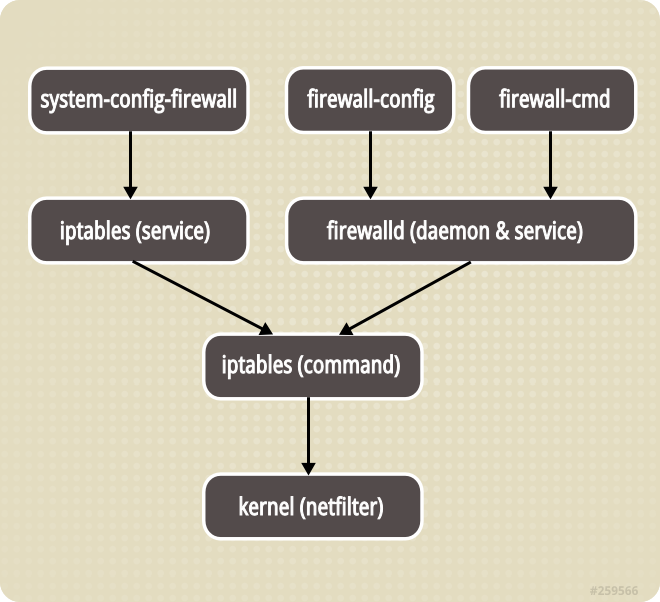

## Введение

Основной брандмауэр в операционных системах Linux — это iptables, но команды iptables сложны, и многим пользователям тяжело запомнить все опции и случаи, в которых их надо использовать. В дистрибутивах семейства RHEL надстройка для управления iptables называется FirewallD.

**FirewallD** — динамически управляемый брандмауэр с поддержкой зон, который определяет уровень доверия сетевых подключений или интерфейсов. Доступен для многих дистрибутивов Linux и выступает в качестве фронтенда для системы фильтрации сетевых пакетов iptables ядра Linux.



## Зоны FirewallD

FirewallD управляет группами правил, используя объекты под названием `зона`.

Каждому сетевому интерфейсу может быть присвоена определённая зона. Зона представляет из себя набор правил, ограничений и разрешений, которые применяются к этому сетевому интерфейсу. Для одного интерфейса может быть выбрана только одна зона.

Предустановленные зоны:
**drop** — самый низкий уровень доверия сети. Весь входящий трафик сбрасывается без уведомления, поддерживаются только исходящие соединения.
**block** — зона похожа на предыдущую, но при этом все входящие запросы сбрасываются с сообщением icmp-host-prohibited для IPv4 или icmp6-adm-prohibited для IPv6.
**public** — зона представляет недоверенную публичную сеть, однако поддерживает предопределённые входящие соединения.
**external** — зона для использования на граничных серверах со связью с внешними сетями. Поддерживается маскировка NAT, благодаря чему внутренняя сеть остается закрытой, но возможны выбранные входящие соединения.
**internal** — противоположна зоне external, используется во внутренних сетях. Компьютерам в этой зоне можно доверять. Доступны дополнительные сервисы.
**dmz** — используется для компьютеров, расположенных в демилитаризованной зоне (для изолированных компьютеров с ограниченным доступом к остальной части сети). Поддерживаются только некоторые входящие соединения.
**work** — зона рабочей сети. Большинству машин в сети можно доверять. Доступны дополнительные сервисы.
**home** — зона домашней сети. Окружению можно доверять, но поддерживаются только определённые пользователем входящие соединения.
**trusted** — всем машинам в сети можно доверять. Самая открытая из доступных опций, поэтому требует разумного использования.

## Сохранение правил

FirewallD использует два набора правил — постоянные (permanent) и временные (runtime). Временные правила представляет собой фактическую рабочую конфигурацию и при перезагрузке не сохраняются. Если правило добавляется или изменяется, поведение запущенного брандмауэра сразу изменяется. Но при перезагрузке все изменения утрачиваются, если они не были сохранены.

По умолчанию при внесении изменений в конфигурацию FirewallD с использованием утилиты `firewall-cmd` изменения применяются к временному набору правил. Большинство команд `firewall-cmd` может использовать флаг `--permanent`, он позволяет cоздать постоянный набор правил, которые будут применяться сразу после выполнения команды перезагрузки.

## Запуск и остановка FirewallD

Запустить FirewallD:

```bash
systemctl start firewalld
```

Включить автостарт:

```bash
systemctl enable firewalld
```

Остановить FirewallD:

```bash
systemctl stop firewalld
```

Отключить автостарт:

```bash
systemctl disable firewalld
```

Проверить работу firewalld с использованием `systemctl`:

```bash
systemctl status firewalld
```

Проверить работу firewalld с использованием `firewall-cmd`:

```bash
firewall-cmd --state
```

## Управление зонами

Для управления зонами используется синтаксис:

```bash
firewall-cmd --конфигурация --zone=зона опции
```

В качестве `конфигурации` нужно указать опцию `--permanent`, чтобы сохранить изменения после перезагрузки или ничего не указывать, тогда изменения будут действительны только до перезагрузки. В качестве `зона` используйте имя нужной зоны.

Основные опции утилиты:
**--state** — вывести состояние брандмауэра.
**--reload** — перезагрузить правила из постоянной конфигурации.
**--complete-reload** — перезагрузка правил с разрывом всех соединений (рекомендуется только в случае проблем).
**--runtime-to-permanent** — перенести настройки временной конфигурации в постоянную.
**--permanent** — использовать постоянную конфигурацию.
**--get-default-zone** — получить зону, используемую по умолчанию.
**--set-default-zone** — установить зону по умолчанию.
**--get-active-zones** — получить активные зоны.
**--get-zones** — получить все доступные зоны.
**--get-services** — получить предопределённые сервисы.
**--list-all-zones** — вывести список всех зон.
**--new-zone** — создать новую зону.
**--delete-zone** — удалить зону.
**--list-all** — вывести список правил из выбранной зоны.
**--list-services** — вывести список сервисов, добавленных к зоне.
**--add-service** — добавить сервис к зоне.
**--remove-service** — удалить сервис из зоны.
**--list-ports** — вывести список портов, добавленные к зоне.
**--add-port** — добавить порт к зоне.
**--remove-port** — удалить порт из зоны.
**--query-port** — показать, добавлен ли порт к зоне.
**--list-protocols** — вывести список протоколов, добавленных к зоне.
**--add-protocol** — добавить протокол к зоне.
**--remove-protocol** — удалить протокол из зоны.
**--panic-on** — включить режим блокировки всех исходящих и входящих пакетов.
**--panic-off** — выключить режим блокировки всех исходящих и входящих пакетов.
**--query-panic** — показать, включен ли режим блокировки всех исходящих и входящих пакетов.

Список всех допустимых зон по-умолчанию:

```bash
firewall-cmd --get-zones
```

Список всех активных зон:

```bash
firewall-cmd --get-active-zones
```

Узнать, к какой зоне он принадлежит сетевой интерфейс:

```bash
firewall-cmd --get-zone-of-interface=eth0
```

Можно перевести интерфейс в другую зону с помощью комбинации параметров `--zone=` и `--change-interface=`.

Переместить интерфейс eth0 в зону home:

```bash
firewall-cmd --zone=home --change-interface=eth0
```

Узнать, какие интерфейсы принадлежат конкретной зоне:

```bash
firewall-cmd --zone=public --list-interfaces
```

Если для вашей задачи возможно расположить все интерфейсы в одной зоне, лучше всего выбрать наиболее подходящую зону и задать её как зону по умолчанию. Для этого используется параметр `--set-default-zone=`.

Установить зону home в качестве зоны по умолчанию:

```bash
firewall-cmd --set-default-zone=home
```

Список постоянно действующих правил:

```bash
firewall-cmd --permanent --list-all
```

## Добавление сервиса к зоне

Список предоопределённых сервисов:

```bash
firewall-cmd --get-services
```

Чтобы подключить сервис используйте параметр `--add-service=`. Указать целевую зону можно с помощью опции `--zone=`. По умолчанию эти изменения будут работать в течение одной сессии. Чтобы сохранить изменения и использовать их на постоянной основе, добавьте флаг `--permanent`.

Разрешить http в зоне public для текущей сессии:

```bash
firewall-cmd --zone=public --add-service=http
```

Если нужно внести изменения в зону по умолчанию, то `--zone=` можно не указывать.

Чтобы проверить, что операция завершилась успешно, используйте `--list-all` или `--list-services`:

```bash
firewall-cmd --zone=public --list-services
```

Если всё работает хорошо, можно изменить постоянные правила брандмауэра, чтобы сервис оставался доступен после перезапуска.

Добавить http в зоне public к постоянному набору правил:

```bash
firewall-cmd --zone=public --permanent --add-service=http
```

Добавив флаг `--permanent` к команде `--list-services` можно убедиться, что изменения применились:

```bash
firewall-cmd --zone=public --permanent --list-services
```

Добавить https в зоне public к текущей сессии и постоянному набору правил:

```bash
firewall-cmd --zone=public --add-service=https
firewall-cmd --zone=public --permanent --add-service=https
```

Сервисы можно перечислять через запятую если заключить их в фигурные скобки `{ }`:

```bash
firewall-cmd --zone=public --permanent --add-service={http,https}
```

## Добавление порта к зоне

Открыть порт 5000 работающий по протоколу tcp в зоне public для текущей сессии используя параметр `--add-port=`:

```bash
firewall-cmd --zone=public --add-port=5000/tcp
```

Протоколы могут быть tcp или udp.

Можно указать диапазон портов, разделив начальный и конечный порт в диапазоне с помощью тире.

Открыть udp порты с 4990 по 4999 в зоне public:

```bash
firewall-cmd --zone=public --add-port=4990-4999/udp
```

После тестирования можно добавить их к постоянным правилам брандмауэра и проверить получившуюся конфигурацию:

```bash
firewall-cmd --zone=public --permanent --add-port=5000/tcp
firewall-cmd --zone=public --permanent --add-port=4990-4999/udp
firewall-cmd --zone=public --permanent --list-ports
```

Порты можно перечислять через запятую если заключить их в фигурные скобки `{ }`:

```bash
firewall-cmd --permanent --add-port={5000/tcp,5000/udp}
```

### Определение нового сервиса

Открыть порты для зон легко, но может быть трудно отследить, для чего предназначен каждый из них. Если вы когда-либо выводили службу из эксплуатации на своём сервере, то могли столкнуться с проблемой вспомнить, какие из открытых портов ещё необходимы. Чтобы избежать этой ситуации, можно определить сервис.

Сервисы представляют собой наборы портов со связанным именем и описанием. Использование сервисов проще в администрировании, чем использование портов, но это требует некоторой предварительной подготовки. Для начала необходимо скопировать существующий скрипт из каталога `/usr/lib/firewalld/services` в каталог `/etc/firewalld/services`, который является местоположением для созданных пользователем сервисов, и заменить в нём параметры.

Скопировать определение сервиса ssh, чтобы использовать его для определения сервиса example:

```bash
cp /usr/lib/firewalld/services/ssh.xml /etc/firewalld/services/example.xml
```

Имя файла должно совпадать с именем сервиса и иметь суффикс `.xml`.

Настроить определение для сервиса example:

```bash
vi /etc/firewalld/services/example.xml
```

Файл `/etc/firewalld/services/example.xml` содержит определение ssh:

```xml
<?xml version="1.0" encoding="utf-8"?>
<service>
  <short>SSH</short>
  <description>Secure Shell (SSH) is a protocol for logging into and executing commands on remote machines. It provides secure encrypted communications. If you plan on accessing your machine remotely via SSH over a firewalled interface, enable this option. You need the openssh-server package installed for this option to be useful.</description>
  <port protocol="tcp" port="22"/>
</service>
```

Большую часть определения составляют метаданные. Короткое имя сервиса в тегах можно изменить на более читаемое имя. Также нужно добавить описание, чтобы понимать, что это за сервис. Единственная конфигурация, которую нужно задать и которая повлияет на работу сервиса, — это определение порта, где следует указать порты и протоколы, которые необходимо открыть.

Для открытия порта 7777 для tcp и 8888 для udp нужно изменить `/etc/firewalld/services/example.xml` и сохранить изменения:

```xml
<?xml version="1.0" encoding="utf-8"?>
<service>
  <short>Example Service</short>
  <description>This is just an example service. It probably shouldn't be used on a real system.</description>
  <port protocol="tcp" port="7777"/>
  <port protocol="udp" port="8888"/>
</service>
```

Перезагрузить брандмауэр, чтобы получить доступ к новому сервису:

```bash
firewall-cmd --reload
```

Список доступных сервисов:

```bash
firewall-cmd --get-services
```

## Создание пользовательских зон

Часто предопределённых зон вполне достаточно для работы, но иногда возникает необходимость определить пользовательские зоны.

Например, создадим зону publicWEB для веб-сервера. Для неё потребуется настроить дополнительную зону для dns, которая предоставляется в частной сети, назовем её privateDNS.

Создавая зону, её нужно добавить к постоянным правилам брандмауэра, а затем перезагрузить FirewallD, чтобы перенести конфигурацию в рабочую сессию.

Создать зоны publicWEB и privateDNS в постоянных правилах:

```bash
firewall-cmd --permanent --new-zone=publicWEB
firewall-cmd --permanent --new-zone=privateDNS
```

Проверить изменения:

```bash
firewall-cmd --get-zones
```

Перезагрузить брандмауэр, чтобы получить доступ к новым зонам:

```bash
firewall-cmd --reload
firewall-cmd --get-zones
```

Теперь можно присвоить новым зонам нужные сервисы и порты. Рекомендуется внести изменения в активный экземпляр и протестировать, а затем перенести их в постоянные правила.

Добавить в зону publicWEB сервисы ssh, http и https и посмотреть результат:

```bash
firewall-cmd --zone=publicweb --add-service=ssh
firewall-cmd --zone=publicweb --add-service=http
firewall-cmd --zone=publicweb --add-service=https
firewall-cmd --zone=publicweb --list-all
```

Добавить dns к зоне privateDNS и посмотреть результат:

```bash
firewall-cmd --zone=privateDNS --add-service=dns
firewall-cmd --zone=privateDNS --list-all
```

Перенести интерфейсы в новые зоны:

```bash
firewall-cmd --zone=publicWEB --change-interface=eth0
firewall-cmd --zone=privateDNS --change-interface=eth1
```

Если заданные значения работают, можно добавить правила к постоянным настройкам.

Применить правила, добавив флаг `--permanent`:

```bash
firewall-cmd --zone=publicweb --permanent --add-service=ssh
firewall-cmd --zone=publicweb --permanent --add-service=http
firewall-cmd --zone=publicweb --permanent --add-service=https
firewall-cmd --zone=privateDNS --permanent --add-service=dns
```

Перезапустить сеть и перезагрузить сервис брандмауэра:

```bash
systemctl restart network
systemctl reload firewalld
```

Убедиться, что зоны были присвоены правильно:

```bash
firewall-cmd --get-active-zones
```

Проверить, что в обеих зонах работают нужные сервисы:

```bash
firewall-cmd --zone=publicweb --list-services
```

```bash
firewall-cmd --zone=privateDNS --list-services
```

Пользовательские зоны созданы! Если вы хотите сделать одну из этих зон зоной по умолчанию для других интерфейсов, используйте параметр `--set-default-zone=`:

```bash
firewall-cmd --set-default-zone=publicweb
```

## Заключение

Мы рассмотрели возможности управления службой FirewallD в системе CentOS, необходимые для повседневного использования.

FirewallD — довольно гибкий и мощный инструмент. Он позволяет конфигурировать поддерживаемые правила и наборы правил с учётом вашей сетевой среды. Он даёт возможность легко менять политику брандмауэра посредством использования зон и позволяет администраторам вынести управление портами в более дружественные определения сервисов.

## Примеры

Список постоянно действующих правил:

```bash
firewall-cmd --permanent --list-all
```

Вывод:

```output
public
  target: default
  icmp-block-inversion: no
  interfaces:
  sources:
  services: dhcpv6-client ssh
  ports:
  protocols:
  masquerade: no
  forward-ports:
  source-ports:
  icmp-blocks:
  rich rules:
```

Список всех активных зон:

```bash
firewall-cmd --get-active-zones
```

Вывод:

```output
public
  interfaces: eth0
```

Так как зона public является зоной по умолчанию, то указание зоны `--zone=public` в коммандах `firewall-cmd` можно опустить.

Удалить dhcpv6-client:

```bash
firewall-cmd --permanent --remove-service=dhcpv6-client
```

Добавить http и https:

```bash
firewall-cmd --permanent --add-service=http
firewall-cmd --permanent --add-service=https
```

Проверить что в конфигурации произошли нужные изменения:

```bash
firewall-cmd --permanent --list-all
```

Вывод:

```output
public
  target: default
  icmp-block-inversion: no
  interfaces:
  sources:
  services: http https ssh
  ports:
  protocols:
  masquerade: no
  forward-ports:
  source-ports:
  icmp-blocks:
  rich rules:
```

Перезагрузить брандмауэр для применения изменений:

```bash
firewall-cmd --reload
```

## Ссылки

[Настройка брандмауэра на CentOS 7 с использованием FirewallD](https://netpoint-dc.com/blog/centos-7-firewalld/)
[Настройка firewalld CentOS 7 с примерами команд](https://bozza.ru/art-259.html)
[RHEL7: How to get started with Firewalld](https://www.certdepot.net/rhel7-get-started-firewalld/)
