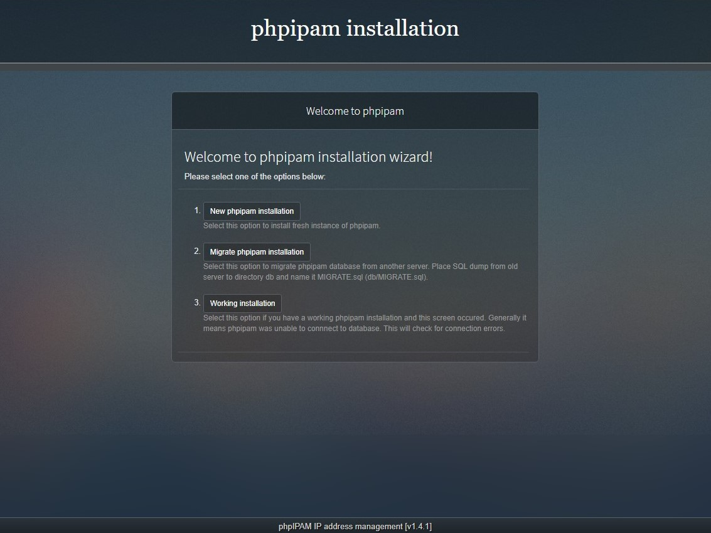
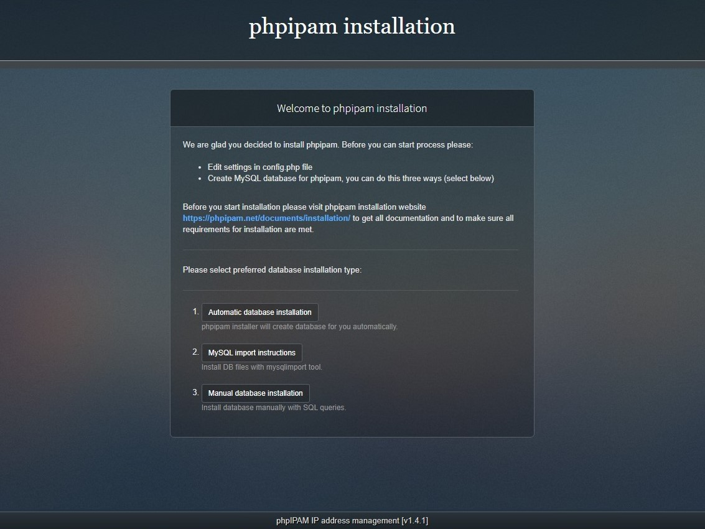
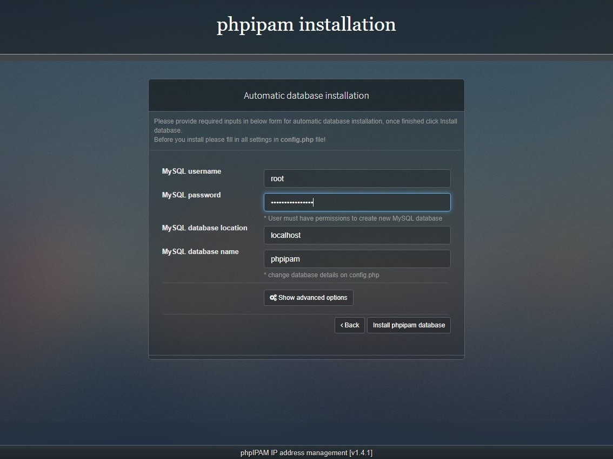
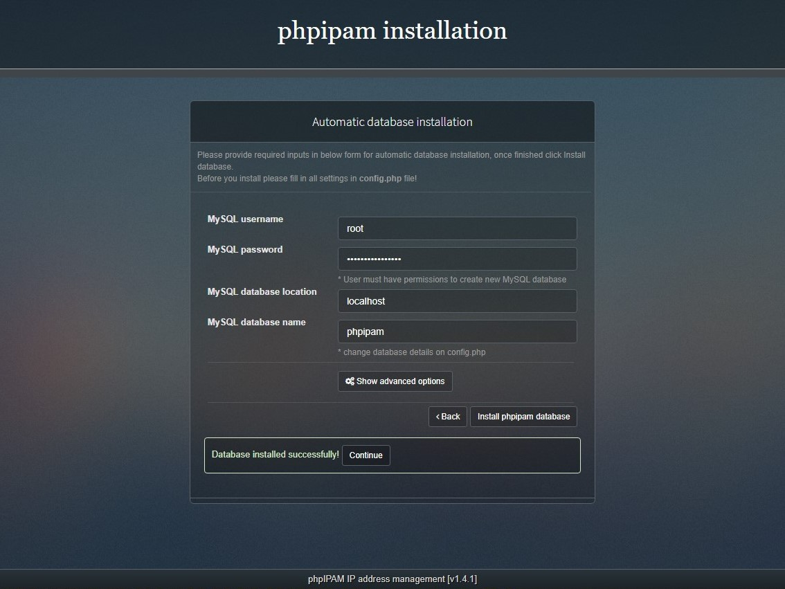
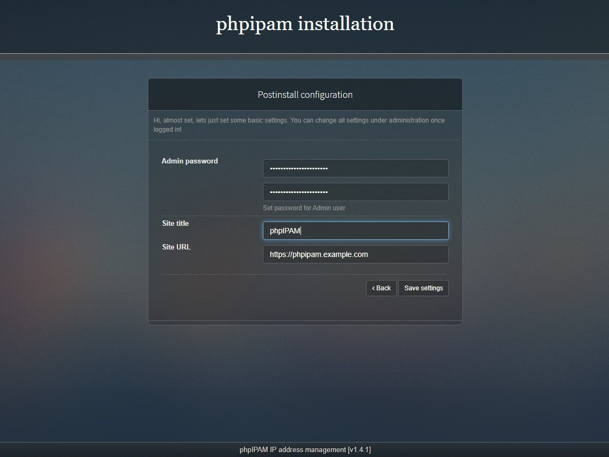
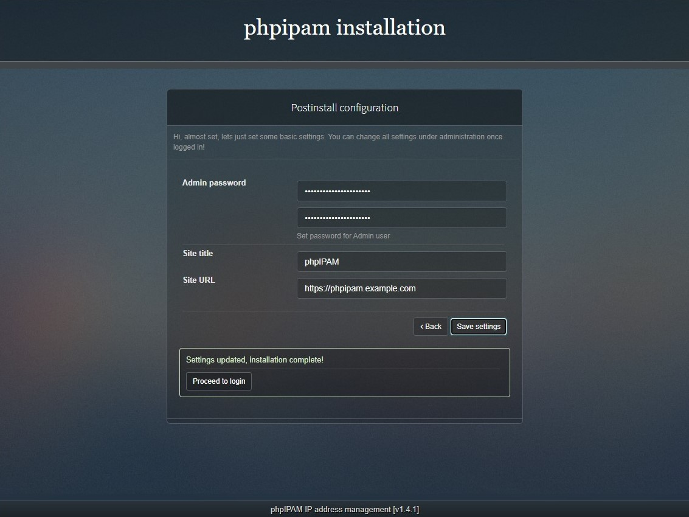
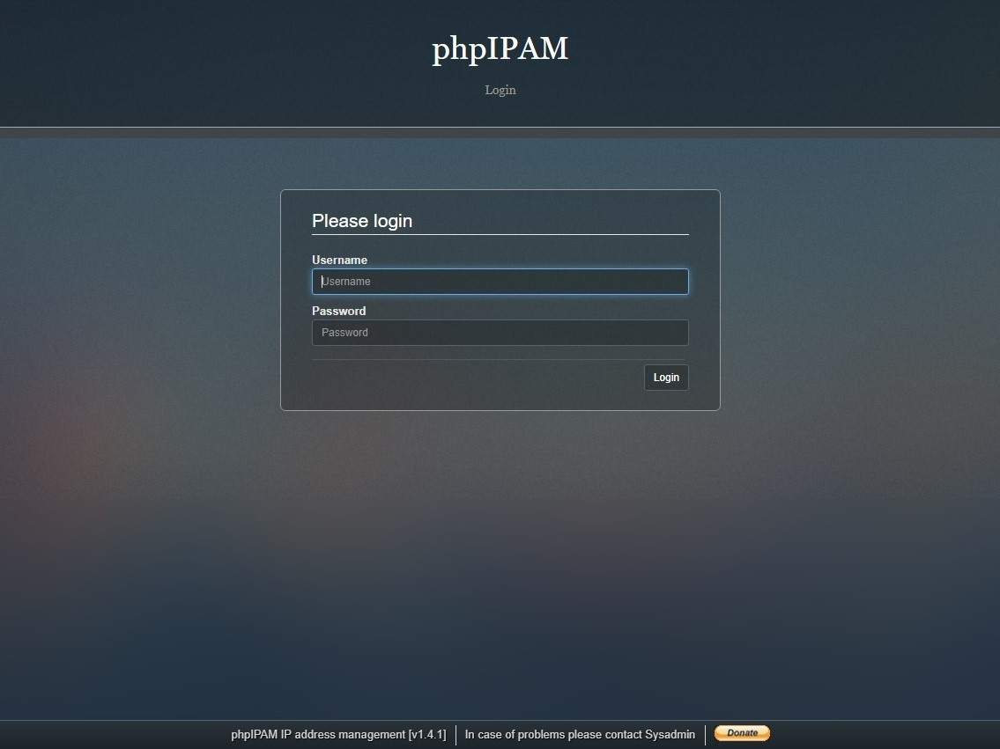

## phpIPAM — управление IP-адресами с открытым исходным кодом

[phpIPAM](https://phpipam.net/) — это приложение для управления IP-адресами (IPAM) с открытым исходным кодом. Его цель — обеспечить лёгкое, современное и удобное управление IP-адресами. Это приложение на основе PHP с базой данных MySQL, использующее библиотеки jQuery, функции AJAX и HTML5/CSS3.

## Установка и настройка phpIPAM на CentOS 7

### Установка NGINX

[[centos7_nginx_install]] CentOS 7: Установка NGINX

Добавить репозиторий:

```bash
vi /etc/yum.repos.d/nginx.repo
```

```ini
[nginx-stable]
name=nginx stable repo
baseurl=http://nginx.org/packages/centos/$releasever/$basearch/
gpgcheck=1
enabled=1
gpgkey=https://nginx.org/keys/nginx_signing.key
module_hotfixes=true

[nginx-mainline]
name=nginx mainline repo
baseurl=http://nginx.org/packages/mainline/centos/$releasever/$basearch/
gpgcheck=1
enabled=0
gpgkey=https://nginx.org/keys/nginx_signing.key
module_hotfixes=true
```

Установить nginx:

```bash
yum install nginx -y
```

Зарегистрировать сервис в автозагрузке:

```bash
systemctl enable nginx
```

### Установка MariaDB

[[centos7_mariadb_install]] CentOS 7: Установка MariaDB

Установить wget:

```bash
yum install wget -y
```

Добавить репозиторий:

```bash
wget https://downloads.mariadb.com/MariaDB/mariadb_repo_setup
chmod +x mariadb_repo_setup
./mariadb_repo_setup
```

Установить сервер:

```bash
yum install MariaDB-server -y
```

Запустить сервис и зарегистрировать его в автозагрузке:

```bash
systemctl start mariadb
systemctl enable mariadb
```

Произвести предварительную настройку:

```bash
mysql_secure_installation
```

```output
Enter current password for root (enter for none): enter
Switch to unix_socket authentication [Y/n] n
Change the root password? [Y/n] y
New password: root-DB-Password
Re-enter new password: root-DB-Password
Remove anonymous users? [Y/n] y
Disallow root login remotely? [Y/n] y
Remove test database and access to it? [Y/n] y
Reload privilege tables now? [Y/n] y
```

### Настройка брандмауэра

[[centos7_firewall_configuration]] CentOS 7: Настройка Firewall

Разрешить http и https:

```bash
firewall-cmd --permanent --add-service={http,https}
```

Перезагрузить брандмауэр для применения изменений:

```bash
firewall-cmd --reload
```

### Создание сертификатов

[[centos7_certificates]] CentOS 7: Сертификаты

Создать каталог для DH:

```bash
mkdir -p /etc/ssl/dhparam/
```

Создать ключ DH:

```bash
openssl dhparam -out /etc/ssl/dhparam/dhparam.pem 2048
```

Создать каталог для размещения сертификатов:

```bash
mkdir -p /etc/ssl/phpipam/
```

Создать самоподписанный сертификат (обратите внимание на наличие опции `-x509`):

```bash
openssl req -x509 -newkey rsa:2048 -sha256 -days 365 -nodes -keyout /etc/ssl/phpipam/phpipam.key -out /etc/ssl/phpipam/phpipam.crt
```

```output
Country Name (2 letter code) [XX]:RU
State or Province Name (full name) []:Moscow
Locality Name (eg, city) [Default City]:Moscow
Organization Name (eg, company) [Default Company Ltd]:Example
Organizational Unit Name (eg, section) []:IT
Common Name (eg, your name or your server's hostname) []:phpipam.example.com
Email Address []:admin@example.com
```

Или создать запрос на сертификат (обратите внимание на отсутствие опции `-x509`):

```bash
openssl req -newkey rsa:2048 -sha256 -nodes -keyout /etc/ssl/phpipam/phpipam.key -out /etc/ssl/phpipam/phpipam.crt
```

```output
Country Name (2 letter code) [XX]:RU
State or Province Name (full name) []:Moscow
Locality Name (eg, city) [Default City]:Moscow
Organization Name (eg, company) [Default Company Ltd]:Example
Organizational Unit Name (eg, section) []:IT
Common Name (eg, your name or your server's hostname) []:phpipam.example.com
Email Address []:admin@example.com

Please enter the following 'extra' attributes
to be sent with your certificate request
A challenge password []:CertificatePassword
An optional company name []:Example
```

### Установка phpIPAM

Добавить репозитории epel и remi:

```bash
yum install epel-release
rpm -Uvh http://rpms.remirepo.net/enterprise/remi-release-7.rpm
```

Установить необходимые пакеты:

```bash
yum install php74 php74-php-fpm php74-php-mysql php74-php-mcrypt php74-php-mbstring php74-php-gd php74-php-xml php74-php-ldap php74-php-gmp php74-php-pear php74-php-snmp git
```

Включить использование сокета:

```bash
vi /etc/opt/remi/php74/php-fpm.d/www.conf
```

```ini
user = nginx
group = nginx
listen = /var/run/php74-fpm.sock
listen.owner = nginx
listen.group = nginx
listen.mode = 0660
```

Изменить права на каталог с сессиями PHP:

```bash
chown -R nginx:nginx /var/opt/remi/php74/lib/php/session/
```

Создать конфигурационный файл с виртуальным доменом в nginx:

```bash
vi /etc/nginx/conf.d/phpipam.conf
```

```nginx
server {
    listen 80 default_server;
    server_name phpipam.example.com;
    return 301 https://$server_name$request_uri;
}

server {
    listen 443 ssl http2;
    set $root_path /var/www/phpipam;
    root $root_path;
    index index.php;

    ssl_certificate /etc/ssl/phpipam/phpipam.crt;
    ssl_certificate_key /etc/ssl/phpipam/phpipam.key;
    ssl_session_timeout 1d;
    ssl_session_cache shared:MozSSL:10m; # about 40000 sessions
    ssl_session_tickets off;

    # Diffie-Hellman parameter for DHE ciphersuites, recommended 2048 bits
    ssl_dhparam /etc/ssl/dhparam/dhparam.pem;

    # intermediate configuration
    ssl_protocols TLSv1.2 TLSv1.3;
    ssl_ciphers ECDHE-ECDSA-AES128-GCM-SHA256:ECDHE-RSA-AES128-GCM-SHA256:ECDHE-ECDSA-AES256-GCM-SHA384:ECDHE-RSA-AES256-GCM-SHA384:ECDHE-ECDSA-CHACHA20-POLY1305:ECDHE-RSA-CHACHA20-POLY1305:DHE-RSA-AES128-GCM-SHA256:DHE-RSA-AES256-GCM-SHA384;
    ssl_prefer_server_ciphers off;

    # HSTS (ngx_http_headers_module is required) (63072000 seconds)
    add_header Strict-Transport-Security "max-age=63072000" always;

    gzip on;
    gzip_comp_level 3;
    gzip_disable "msie6";
    gzip_min_length 512;
    gzip_vary on;
    gzip_proxied any;
    gzip_types text/plain text/css application/json application/x-javascript text/xml application/xml application/xml+rss text/javascript application/javascript;

    location ~ \.php$ {
        fastcgi_pass unix:/var/run/php74-fpm.sock;
        fastcgi_index index.php;
        fastcgi_param SCRIPT_FILENAME $root_path$fastcgi_script_name;
        include fastcgi_params;
        fastcgi_param DOCUMENT_ROOT $root_path;
    }
}
```

Проверить конфигурацию:

```bash
nginx -t
```

Изменить `max_execution_time` и временную зону в `php.ini`:

```bash
vi /etc/opt/remi/php74/php.ini
```

```ini
max_execution_time = 60
date.timezone = Europe/Moscow
```

При необходимости путь к конфигурационному файлу `php.ini` можно посмотреть командой:

```bash
php74 -i | grep php.ini
```

Зарегистрировать модуль php-fpm в автозагрузке:

```bash
systemctl enable php74-php-fpm
```

Создать каталог www:

```bash
mkdir -p /var/www/
```

Загрузить phpIPAM и выбрать нужную версию:

```bash
git clone --recursive https://github.com/phpipam/phpipam.git /var/www/phpipam/
cd /var/www/phpipam/
git checkout -b 1.4 origin/1.4
```

Создать копию конфигурационного файла `/var/www/phpipam/config.dist.php`:

```bash
cp config.dist.php config.php
```

Изменить конфигурационный файл `/var/www/phpipam/config.php`:

```bash
vi config.php
```

```ini
$db['host'] = "localhost";
$db['user'] = "phpipam";
$db['pass'] = "phpIPAM-Admin-DB-Password";
$db['name'] = "phpipam";
$db['port'] = 3306;
```

Назначить права доступа:

```bash
chown nginx:nginx -R /var/www/phpipam/
```

Bосстановить контекст SELinux для всех содержащихся в нём файлов:

```bash
restorecon -R -v /var/www/phpipam/
```

[SElinux policy for icmp checks](https://phpipam.net/news/selinux-policy-for-icmp-checks/)
Создать политику SElinux, для phpIPAM. Это позволит открывать необработанные IP-сокеты для пользователей без полномочий root, которые необходимы для выполнения команды ping.

Создать файл `http_ping.tt`:

```bash
vi http_ping.tt
```

```module
module http_ping 1.0;

require {
type httpd_t;
class capability net_raw;
class rawip_socket { getopt create setopt write read };
}

#============= httpd_t ==============
allow httpd_t self:capability net_raw;
allow httpd_t self:rawip_socket { getopt create setopt write read };
```

Выполнить следующие команды:

```bash
checkmodule -M -m -o http_ping.mod http_ping.tt
semodule_package -o http_ping.pp -m http_ping.mod
semodule -i http_ping.pp
```

Запустить php-fpm и nginx:

```bash
systemctl start php74-php-fpm
systemctl start nginx
```

Подключиться в браузере к созданному сайту (phpipam.example.com) и произвести настройку:


`New phpipam installation`


`Automatic database installation`



```info
MySQL username: root
MySQL password: root-DB-Password
MySQL database location: localhost
MySQL database name: phpipam
```

`Install phpipam database`


`Continue`



```info
Admin password: phpIPAM-Admin-Password
Site title: phpIPAM
Site URL: https://phpipam.example.com
```

`Save settings`


`Proceed to login`



```info
Username: admin
Password: phpIPAM-Admin-Password
```

## Настройка phpIPAM

### Настройка LDAP аутентификации

Для использование LDAP аутентификации необходимо включить политику SELinux `httpd_can_connect_ldap`:

```bash
setsebool -P httpd_can_connect_ldap on
```

### Настройка отправки почты

Для отправки почты необходимо включить политику SELinux `httpd_can_sendmail`:

```bash
setsebool -P httpd_can_sendmail on
```

## Известные ошибки

### Установка обновлений PHP

После установки обновлений PHP  необходимо переназначить права на каталог с сессиями PHP:

```bash
chown -R nginx:nginx /var/opt/remi/php73/lib/php/session/
```

## Создание резервной копии

База данных отделена от кода, поэтому, если что-то пойдёт не так, всегда можно восстановить её из резервной копии.

Создать резервную копию базы данных MySQL:

```bash
cd /var/www/phpipam/
/usr/bin/mysqldump -u phpipam -pphpIPAM-Admin-DB-Password phpipam > db/bkp/phpipam_backup.db
```

Также сделайте резервную копию файла `config.php`, содержащего настройки подключения phpIPAM к базе данных.

### Создание резервной копии через cron

Рекомендуется делать ежедневные резервные копии файлов базы данных через cron.

Cronjob для ежедневного резервного копирования:

```cron
# Backup IP address table, remove backups older than 10 days
@daily /usr/bin/mysqldump -u ipv6 -pipv6admin phpipam > /var/www/html/db/bkp/phpipam_bkp_$(date +"\%y\%m\%d").db
@daily /usr/bin/find /var/www/html/db/bkp/ -ctime +10 -exec rm {} \;
```

## Обновление phpIPAM

Перед обновлением создайте резервную копию базы данных и конфигурационного файла `config.php`.

Обновление кода:

```bash
cd /var/www/phpipam
git pull
git checkout -b 1.4 origin/1.4
git submodule update --init --recursive
```

Обновление базы данных:
Откройте браузер, войдите под администратором и выполните процедуру обновления.

## Ссылки

[phpIPAM installation on CentOS 7](https://phpipam.net/news/phpipam-installation-on-centos-7/)
[phpIPAM upgrading](https://phpipam.net/documents/upgrade/)
