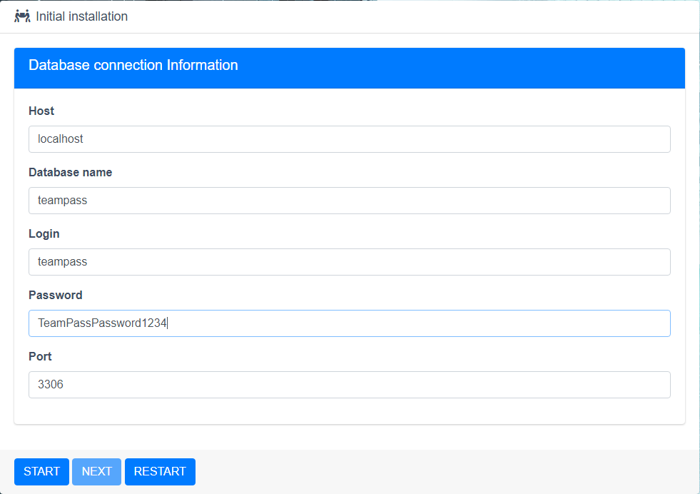

## TeamPass — Collaborative Password Manager

[TeamPass](https://teampass.net/) — это приложение для совместной работы с паролями. Приложение написано на PHP, для хранения данных используется база данных MySQL (MariaDB).

## Установка и настройка TeamPass на CentOS 7

### Установка NGINX

[[centos7_nginx_install]] CentOS 7: Установка NGINX

Добавить репозиторий:

```bash
vi /etc/yum.repos.d/nginx.repo
```

```ini
[nginx-stable]
name=nginx stable repo
baseurl=http://nginx.org/packages/centos/$releasever/$basearch/
gpgcheck=1
enabled=1
gpgkey=https://nginx.org/keys/nginx_signing.key
module_hotfixes=true

[nginx-mainline]
name=nginx mainline repo
baseurl=http://nginx.org/packages/mainline/centos/$releasever/$basearch/
gpgcheck=1
enabled=0
gpgkey=https://nginx.org/keys/nginx_signing.key
module_hotfixes=true
```

Установить NGINX:

```bash
yum install nginx -y
```

Зарегистрировать сервис в автозагрузке:

```bash
systemctl enable nginx
```

### Установка MariaDB

[[centos7_mariadb_install]] CentOS 7: Установка MariaDB

Установить wget:

```bash
yum install wget -y
```

Добавить репозиторий:

```bash
wget https://downloads.mariadb.com/MariaDB/mariadb_repo_setup
chmod +x mariadb_repo_setup
./mariadb_repo_setup
```

Установить сервер:

```bash
yum install MariaDB-server -y
```

Запустить сервис и зарегистрировать его в автозагрузке:

```bash
systemctl start mariadb
systemctl enable mariadb
```

Произвести предварительную настройку:

```bash
mariadb-secure-installation
```

```output
Enter current password for root (enter for none): enter
Switch to unix_socket authentication [Y/n] n
Change the root password? [Y/n] y
New password: root-DB-Password
Re-enter new password: root-DB-Password
Remove anonymous users? [Y/n] y
Disallow root login remotely? [Y/n] y
Remove test database and access to it? [Y/n] y
Reload privilege tables now? [Y/n] y
```

### Настройка брандмауэра

[[centos7_firewall_configuration]] CentOS 7: Настройка Firewall

Разрешить http и https:

```bash
firewall-cmd --permanent --add-service={http,https}
```

Перезагрузить брандмауэр для применения изменений:

```bash
firewall-cmd --reload
```

### Создание сертификатов

[[centos7_certificates]] CentOS 7: Сертификаты

Создать каталог для ключа протокола Диффи-Хеллмана (Diffie–Hellman — DH):

```bash
mkdir -p /etc/ssl/dhparam/
```

Создать ключ DH:

```bash
openssl dhparam -out /etc/ssl/dhparam/dhparam.pem 2048
```

Создать каталог для размещения сертификатов:

```bash
mkdir -p /etc/ssl/teampass/
```

Создать самоподписанный сертификат (обратите внимание на наличие опции `-x509`):

```bash
openssl req -x509 -newkey rsa:2048 -sha256 -days 365 -nodes -keyout /etc/ssl/teampass/teampass.key -out /etc/ssl/teampass/teampass.crt
```

```output
Country Name (2 letter code) [XX]:RU
State or Province Name (full name) []:Moscow
Locality Name (eg, city) [Default City]:Moscow
Organization Name (eg, company) [Default Company Ltd]:Example
Organizational Unit Name (eg, section) []:IT
Common Name (eg, your name or your server's hostname) []:teampass.example.com
Email Address []:admin@example.com
```

Или создать запрос на сертификат (обратите внимание на отсутствие опции `-x509`):

```bash
openssl req -newkey rsa:2048 -sha256 -nodes -keyout /etc/ssl/teampass/teampass.key -out /etc/ssl/teampass/teampass.crt
```

```output
Country Name (2 letter code) [XX]:RU
State or Province Name (full name) []:Moscow
Locality Name (eg, city) [Default City]:Moscow
Organization Name (eg, company) [Default Company Ltd]:Example
Organizational Unit Name (eg, section) []:IT
Common Name (eg, your name or your server's hostname) []:teampass.example.com
Email Address []:admin@example.com

Please enter the following 'extra' attributes
to be sent with your certificate request
A challenge password []:CertificatePassword
An optional company name []:Example
```

### Установка TeamPass

Добавить репозитории epel и remi:

```bash
yum install epel-release -y
rpm -Uvh http://rpms.remirepo.net/enterprise/remi-release-7.rpm
```

Установить необходимые пакеты:

```bash
yum install php74 php74-php-fpm php74-php-mysql php74-php-mcrypt php74-php-mbstring php74-php-bcmath php74-php-gd php74-php-xml php74-php-ldap git -y
```

Включить использование сокета:

```bash
vi /etc/opt/remi/php74/php-fpm.d/www.conf
```

```ini
user = nginx
group = nginx
listen = /var/run/php74-fpm.sock
listen.owner = nginx
listen.group = nginx
listen.mode = 0660
```

Изменить права на каталог с сессиями PHP:

```bash
chown -R nginx:nginx /var/opt/remi/php74/lib/php/session/
```

Создать конфигурационный файл с виртуальным доменом NGINX:

```bash
vi /etc/nginx/conf.d/teampass.conf
```

```nginx
server {
    listen 80 default_server;
    server_name teampass.example.com;
    return 301 https://$server_name$request_uri;
}

server {
    listen 443 ssl http2;
    set $root_path /var/www/teampass;
    root $root_path;
    index index.php;

    ssl_certificate /etc/ssl/teampass/teampass.crt;
    ssl_certificate_key /etc/ssl/teampass/teampass.key;
    ssl_session_timeout 1d;
    ssl_session_cache shared:MozSSL:10m; # about 40000 sessions
    ssl_session_tickets off;

    # Diffie-Hellman parameter for DHE ciphersuites, recommended 2048 bits
    ssl_dhparam /etc/ssl/dhparam/dhparam.pem;

    # intermediate configuration
    ssl_protocols TLSv1.2 TLSv1.3;
    ssl_ciphers ECDHE-ECDSA-AES128-GCM-SHA256:ECDHE-RSA-AES128-GCM-SHA256:ECDHE-ECDSA-AES256-GCM-SHA384:ECDHE-RSA-AES256-GCM-SHA384:ECDHE-ECDSA-CHACHA20-POLY1305:ECDHE-RSA-CHACHA20-POLY1305:DHE-RSA-AES128-GCM-SHA256:DHE-RSA-AES256-GCM-SHA384;
    ssl_prefer_server_ciphers off;

    # HSTS (ngx_http_headers_module is required) (63072000 seconds)
    add_header Strict-Transport-Security "max-age=63072000" always;

    gzip on;
    gzip_comp_level 3;
    gzip_disable "msie6";
    gzip_min_length 512;
    gzip_vary on;
    gzip_proxied any;
    gzip_types text/plain text/css application/json application/x-javascript text/xml application/xml application/xml+rss text/javascript application/javascript;

    location ~ \.php$ {
        fastcgi_pass unix:/var/run/php74-fpm.sock;
        fastcgi_index index.php;
        fastcgi_param SCRIPT_FILENAME $root_path$fastcgi_script_name;
        include fastcgi_params;
        fastcgi_param DOCUMENT_ROOT $root_path;
    }
}
```

Проверить конфигурацию:

```bash
nginx -t
```

Изменить `max_execution_time` и временную зону в `php.ini`:

```bash
vi /etc/opt/remi/php74/php.ini
```

```ini
max_execution_time = 60
date.timezone = Europe/Moscow
```

Зарегистрировать модуль php-fpm в автозагрузке:

```bash
systemctl enable php74-php-fpm
```

Создать каталог для сайта:

```bash
mkdir -p /var/www/teampass/
```

Создать каталог для saltkey

```bash
mkdir -p /var/teampass/
```

Загрузить TeamPass и выбрать нужную версию:

```bash
git clone https://github.com/nilsteampassnet/TeamPass.git /var/www/teampass/
cd /var/www/teampass/
git checkout 2.1.27.36
```

Назначить права доступа:

```bash
chown -R nginx:nginx /var/www/teampass/
chown -R nginx:nginx /var/teampass/
```

Восстановить контекст SELinux для всех файлов в каталоге `/var/www/teampass/`:

```bash
restorecon -R -v /var/www/teampass/
```

Сменить контекст SELinux для следующих каталогов:

```bash
chcon -t httpd_sys_rw_content_t /var/www/teampass/install/
chcon -t httpd_sys_rw_content_t /var/www/teampass/includes/
chcon -t httpd_sys_rw_content_t /var/www/teampass/includes/config/
chcon -t httpd_sys_rw_content_t /var/www/teampass/includes/avatars/
chcon -t httpd_sys_rw_content_t /var/www/teampass/includes/libraries/csrfp/libs/
chcon -t httpd_sys_rw_content_t /var/www/teampass/includes/libraries/csrfp/js/
chcon -t httpd_sys_rw_content_t /var/www/teampass/includes/libraries/csrfp/log/
chcon -t httpd_sys_rw_content_t /var/www/teampass/files/
chcon -t httpd_sys_rw_content_t /var/www/teampass/upload/
```

Чтобы не вводить множество однотипных команд, можно использовать одну команду `chcon -t httpd_sys_rw_content_t` указав пути через пробел. При использовании относительных путей, предыдущий набор команд можно заменить одной:

```bash
chcon -t httpd_sys_rw_content_t install/ includes/ includes/config/ includes/avatars/ includes/libraries/csrfp/libs/ includes/libraries/csrfp/js/ includes/libraries/csrfp/log/ files/ upload/
```

Создать файл `nginx.pid` в каталоге `/var/run/` и восстановить контекст SELinux:

```bash
touch /var/run/nginx.pid
restorecon -v /var/run/nginx.pid
```

Запустить php-fpm и NGINX:

```bash
systemctl start php74-php-fpm
systemctl start nginx
```

Зайти в консоль управления базой данных mysql-shell:

```bash
mysql -uroot -p
```

Создать новую базу:

```mariadb
CREATE DATABASE teampass DEFAULT CHARACTER SET utf8 DEFAULT COLLATE utf8_general_ci;
```

Создать пользователя с доступом к созданной базе данных:

```mariadb
GRANT ALL PRIVILEGES ON teampass.* TO teampass@localhost IDENTIFIED BY 'TeamPassPassword1234';
```

Отключиться от mysql-shell (`quit`, `exit` или `\q`):

```mariadb
exit
```

Подключиться в браузере к созданному сайту (teampass.example.com) и произвести окончательно установку.

Процесс установки TeamPass v2:


`NEXT`


`LAUNCH/NEXT`


```info
Host: localhost
DataBase name: teampass
Login: teampass
Password: TeamPassPassword1234
Port: 3306
```

`LAUNCH/NEXT`


```info
Absolute path to SaltKey: /var/teampass/
Teampass Administrator password: TeamPassAdminPassword1234
```

`LAUNCH/NEXT`


`LAUNCH/NEXT`


`LAUNCH/NEXT`


`Move to home page`


Удалить каталог `/var/www/teampass/install/`:

```bash
rm -rf /var/www/teampass/install/
```

Если этого не сделать, то залогиниться в TeamPass не удастся.

## Настройка TeamPass

Для того чтобы пользоваться TeamPass необходимо:

- Создать общие каталоги
- Создать роли пользователей
- Создать пользователей
- Назначить права доступа для пользователей и ролей
- Вывести из режима обслуживания


Режим администрирования.


Создание каталогов.


Создание ролей и назначение прав доступа.

### Настройка LDAP

Включить политику SELinux `httpd_can_connect_ldap`:

```bash
setsebool -P httpd_can_connect_ldap on
```

Добавить корневой сертификат с помощью которого был выпущен сертификат сервера LDAP в доверенное хранилище `/etc/pki/ca-trust/source/anchors`.

Обновить информацию о доверенных корневых сертификатах:

```bash
update-ca-trust
```

Включить и настроить аутентификацию через LDAPS:


При первом входе пользователя домена example.com учётная запись будет создана автоматически, а пользователь будет добавлен в группу указанную в пункте `Newly created user has role` и получит соответствующие группе доступы.

При необходимости LDAP пользователи могут быть созданы с другими настройками заранее:


### Настройка отправки почты

Включить политику SELinux `httpd_can_sendmail`:

```bash
setsebool -P httpd_can_sendmail on
```

Указать параметры для SMTP сервера:


### Завершение настроек

При необходимости внести изменения в другие настройки.

Перед выходом из режима администрирования отключить `maintenance mode`:


Подключится под обычным пользователем. Доступ к каталогам будет в соответствии с установленными правами доступа:


## Известные ошибки

### Установка обновлений PHP

После установки обновлений PHP  необходимо переназначить права на каталог с сессиями PHP:

```bash
chown -R nginx:nginx /var/opt/remi/php74/lib/php/session/
```

### Кодировка

В версии TemPass 2.1.27.36 имеется ошибка при отображении логинов написанных не латинскими символами ([Label does not support accent like éàè #2681](https://github.com/nilsteampassnet/TeamPass/issues/2681)). Для устранения ошибки в отображении необходимо в файле `/var/www/teampass/items.load.php` в строке 510 (секция `Appenditem row`) заменить значение `value.label` на `decodeURIComponent(escape(value.label))` :

```bash
vi /var/www/teampass/items.load.php
```

```php
// Appenditem row
$("#full_items_list").append(
    '<li name="' + value.label + '" class="'+ item_class + ' trunc_line" id="'+value.item_id+'" data-edition="'+value.open_edit+'">' + item_span +
    item_flag +
    '<i class="fa ' + value.perso + ' fa-sm"></i>&nbsp' +
    '&nbsp;<a id="fileclass'+value.item_id+'" class="file " onclick="AfficherDetailsItem(\''+value.item_id+'\',\''+value.sk+'\',\''+value.expired+'\', \''+value.restricted+'\', \''+value.display+'\', \'\', \''+value.reload+'\', \''+value.tree_id+'\')"  ondblclick="AfficherDetailsItem(\''+value.item_id+'\',\''+value.sk+'\',\''+value.expired+'\', \''+value.restricted+'\', \''+value.display+'\', \''+value.open_edit+'\', \''+value.reload+'\', \''+value.tree_id+'\')"><div class="truncate">'+
    '<span id="item_label_' + value.item_id + '">' + decodeURIComponent(escape(value.label)) + '</span>&nbsp;<font size="1px">' +
    value.desc +
    '</div></font></a>' +
    '<span style="float:right;margin-top:2px;">' +
    pwd_error +
    icon_all_can_modify +
    icon_login +
    icon_pwd +
    icon_favorite +
    '</span>' +
    '</li>'
);
```

### LDAPS

При использовании старых корневых сертификатов SHA1 LDAPS может не заработать. Более подробно о причинах можно узнать припомощи утилиты `ldapsearch` (данная утилита входит в пакет `openldap-clients` и по умолчанию не установлена).

Установить `openldap-clients`:

```bash
yum install openldap-clients -y
```

Проверить подключение LDAP:

```bash
ldapsearch -h dc.example.com -D user@example.com -W -b OU=user,DC=example,DC=com
```

Проверить подключение LDAPS:

```bash
ldapsearch -ZZ -h dc.example.com -D user@example.com -W -b OU=user,DC=example,DC=com
```

Если при проверке будет выдана ошибка содержащая строку `certificate verify failed (EE certificate key too weak)`, то значит данный сертификат слишком «слабый» для текущего уровня безопасности. В качестве временного решения можно снизить уровень безопасности ([System-wide crypto policies in RHEL 8 - Red Hat Customer Portal](https://access.redhat.com/articles/3666211)):

```bash
update-crypto-policies --set LEGACY
```

## Резервное копирование

Резервная копия должна содержать:

- Базу данных `teampass`
- Файл `teampass-seckey.txt`
- Файл `sk.php`
- Файл `includes\libraries\csrfp\libs\csrfp.config.php`
- Каталог `upload`

## TeamPass v3

TeamPass v3 на данный момент находится в статусе `beta`.

Процесс установки TeamPass v3 не отличается от аналогичного процесса установки v2:


`START`


`START`



```info
Host: localhost
DataBase name: teampass
Login: teampass
Password: TeamPassPassword1234
Port: 3306
```

`START`


```info
Absolute path to SaltKey: /var/teampass/
Teampass Administrator password: TeamPassAdminPassword1234
```

`START`


`START`


`Move to home page`


Удалить каталог `/var/www/teampass/install/`:

```bash
rm -rf /var/www/teampass/install/
```

В версии TemPass 3.0.0.7 не работает подключение к LDAP: [LDAP - Active directory issue](https://www.reddit.com/r/TeamPass/comments/kv1sxk/ldap_active_directory_issue/)

При загрузке файлов они помещаются в каталог `upload`, но при отображении в интерфейсе они берутся из каталога `files` и соответственно не отображаются.

Нет поддержки русского языка в интерфейсе.

Обновление с предыдущей версии пока не поддерживается (только новая установка).

На текущий момент не рекомендую данную версию к установке.

## Ссылки

[Teampass.net](https://teampass.net/)

[GitHub - nilsteampassnet/TeamPass: Collaborative Passwords Manager](https://github.com/nilsteampassnet/TeamPass)

[Home - Teampass Documentation](https://teampass.readthedocs.io/en/latest/)

[Mozilla SSL Configuration Generator](https://ssl-config.mozilla.org/)