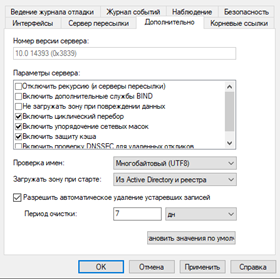

**Domain Name System (DNS)** — компьютерная распределённая система для получения информации о доменах, одна из самых важных ролей в Active Directory (AD). Без нормальной работы DNS, нормальная работа AD будет невозможна, поэтому настройке и защите данной службы нужно уделить максимум внимания.

**Dynamic Host Configuration Protocol (DHCP)** — протокол, отвечающий за динамическую выдачу IP-адресов устройствам сети. Упрощает работу системного администратора – специалисту не требуется каждый раз вручную назначать IP-адреса новым компьютерам.

## Служба DNS на контроллерах домена

Если DNS-сервер используется только для домена AD, то устанавливать службу DNS нужно только на контроллеры домена. В этом случае службы DNS могут хранить свои зоны в Active Directory Domain Services (AD DS).

Таким образом, не будет необходимости настраивать отдельную топологию репликации DNS, которая использует обычные передачи зон DNS, так как все данные зоны реплицируются автоматически с помощью AD репликации. Это упрощает процесс развёртывания DNS и предоставляет следующие преимущества:

- Множественная репликация DNS (multiple masters are created for DNS replication). Таким образом, любой контроллер домена в домене, на котором запущена служба DNS-сервера, может записывать обновления в зоны DNS, интегрированные в AD, для доменного имени, для которого они являются полномочными. Отдельная топология зонных передач DNS не требуется.

- Поддерживаются безопасные динамические обновления (secure dynamic updates). Безопасные динамические обновления позволяют администратору управлять тем, какие компьютеры обновляют имена, и предотвращать перезапись существующих имён в DNS неавторизованными компьютерами.

Начиная с Windows Server 2008 служба DNS интегрированная в AD хранит данные зоны в разделах каталога приложений (application directory partitions). Во время установки AD DS создаются следующие разделы каталога приложений, относящиеся к DNS:

- Раздел каталога приложений на уровне леса с именем `ForestDnsZones`
- Разделы каталога приложений на уровне домена для каждого домена леса с именем `DomainDnsZones`

При использовании в домене более чем одного контролера домена (Windows Server 2003) рекомендуется настраивать параметры клиента DNS (в настройках сетевого адаптера) так, чтобы они указывали на другой контроллер домена, на котором работает DNS в их домене и сайте, и на котором размещается пространство имён домена, в котором установлен новый контроллер домена. Несоблюдение этого правила может привести к возникновению ошибки называемой «остров» DNS (DNS «Islands»).

> Начиная с Windows Server 2008 R2 эта проблема не так актуальна, но всё ещё возможна при определённых обстоятельствах.

Так же в качестве адреса DNS сервера на контроллере домена необходимо указывать адрес обратной связи (loopback IP address), но не в качестве основного DNS-сервера. В определенных ситуациях, таких как изменение топологии, это может нарушить репликацию и привести к тому, что сервер будет «на острове» в отношении репликации.

Даже если проблема «острова» вас никогда не затронет, ваш DC всё равно будет перезагружаться гораздо быстрее и с меньшим количеством ошибок, если он будет использовать другой уже запущенный и работающий DC в качестве основного DNS сервера.

В среде с несколькими площадками члены домена должны быть настроены на использование DNS-серверов сначала на их локальном сайте, а потом уже на другом сайте. Это позволяет свести к минимуму объем DNS-трафика, передаваемого по каналам связи WAN.

Все подключенные к домену компьютеры должны использовать только внутренние DNS-серверы. Если подключенный к домену компьютер настроен на использование внешнего сервера в качестве альтернативного DNS-сервера, временное отсутствие подключения к внутреннему DNS-серверу может привести к тому, что компьютер будет использовать для разрешения внешний сервер. Внешний сервер не сможет разрешить запросы на объекты внутри домена AD, и при восстановлении подключения клиентский компьютер не будет автоматически подключен к внутреннему DNS-серверу. Как правило, это проявляется как неспособность получить доступ к ресурсам в домене при использовании соответствующего компьютера.

## Ограничение прослушивания запросов DNS на интерфейсах

По умолчанию DNS-сервер слушает трафик и реагирует на запросы со всех интерфейсов. Это включает в себя все IPv4 адреса и все IPv6. При добавлении нового интерфейса он будет сразу же использоваться службой DNS. Имеет смысл из соображений предсказуемости переключить эту настройку на явное указание адресов, на которых DNS-сервер будет принимать трафик.


В `Свойствах` (`Properties`) DNS-сервера, на вкладке `Интерфейсы` (`Interfaces`) в явном виде выбрать только те адреса, на которые нужно принимать DNS запросы.

## Ограничение DNS запросов

Разрешить доступ к сети интернет по 51 порту (порт для DNS запросов) на корпоративном фаерволе только DNS-серверам. Это позволит снизить успешность атаки подмены DNS-серверов на клиентской машине. Стоит учесть, что может использоваться как UDP (основная масса запросов), так и TCP (если ответ содержит много записей).

## Серверы пересылки и корневые серверы

По возможности не стоит использовать серверы пересылки, так как рекурсивно сервер сам может разрешить запрос используя корневые серверы, а собственному серверу доверия больше чем стороннему.

При необходимости можно несколько ускорить рекурсивное разрешение имён если оптимизировать список корневых серверов оставив в нём только наиболее близкие.

Посмотреть имена ближайших корневых серверов можно здесь: [root-servers.org](https://root-servers.org/)

## DNS, LLMNR, WINS (NetBIOS)

Необходимо стремиться к использованию в домене AD для разрешения имён исключительно DNS запросы. Для этого необходимо планомерно ограничивать использование других протоколов разрешения имён в плоть до их полного отключения. Это связано с тем, что использование устаревших протоколов без явной необходимости может являться потенциальной брешью в безопасности компьютерной сети.

**NetBIOS over TCP/IP (UDP/137, 138; TCP/139)** — является широковещательным протоколом и используется в локальной сети для публикации и поиска ресурсов. Поддержка NetBIOS over TCP/IP по умолчанию включена для всех интерфейсов во всех ОС Windows.

**Link-Local Multicast Name Resolution (UDP/5355)** — присутствует во всех версиях Windows, начиная с Vista и позволяет IPv6 и IPv4 клиентам за счёт широковещательных запросов в локальном сегменте сети L2 разрешать имена соседних компьютеров без использования DNS-сервера. Этот протокол автоматически используется при недоступности DNS. Соответственно, при работающих DNS-серверах в домене, этот протокол не нужен.

Широковещательные протоколы NetBIOS через TCP/IP и LLMNR являются устаревшими протоколами, и в большинстве современных сетей они используются в целях совместимости. Так же широковещательные протоколы довольно расточительны и могут занимать до 10-20% полосы пропускания сети. Одновременно с этим есть различные инструменты, позволяющие использовать уязвимости в протоколах NetBIOS и LLMNR для перехвата учётных данных пользователей в локальной подсети (в т.ч. хэши NTLMv2). Поэтому в целях безопасности, в доменной сети эти протоколы следует отключать.

Перед массовым отключением устаревших протоколов в домене с помощью политик, необходимо протестировать работу компьютеров с отключёнными NetBIOS и LLMNR на тестовых группах компьютеров и серверов. И если проблем с отключением LLMNR нет, отключение NetBIOS может нарушить работу устаревших систем.

### Отключение NetBIOS через TCP/IP

На конкретном клиенте отключить NetBIOS можно вручную с использованием оснастки — свойства сетевого подключения.

1. Выберите протокол `TCP/IPv4` и откройте его свойства;

2. Нажмите кнопку `Дополнительно` (`Advanced`), затем перейдите на вкладку WINS и выберите опцию `Отключить NetBIOS через TCP/IP` (`Disable NetBIOS over TCP`).


Или из командной строки:

1. Получите статус NetBIOS через TCP/IP для всех сетевых адаптеров:

   `wmic nicconfig get caption,index,TcpipNetbiosOptions`

2. Укажите правильный индекс сетевого адаптера (например 8) и выполните команду:

   `wmic nicconfig where index=8 call SetTcpipNetbios 2`

Доступные опции:

- 0 — Use NetBIOS setting from the DHCP server

- 1 — Enable NetBIOS over TCP/IP
- 2 — Disable NetBIOS over TCP/IP

На клиентах домена, получающих IP-адреса с DHCP-сервера, отключить NetBIOS через TCP/IP можно через настройку опций DHCP-сервера:

1. Откройте консоль `dhcpmgmt.msc` и выберите `Настроить параметры` (`Configure Options`) в `Параметры сервера` (`Server Options`) или `Параметры области` (`Scope Option`);

2. Перейдите на вкладку `Дополнительно` (`Advanced`), в выпадающем списке `Класс поставщика` (`Vendor class`) выберите `Microsoft Windows 2000 Options`;

3. Включите опцию `001 Microsoft Disable Netbios Option` и измените её значение на `0x2`.


## Отключение протокола LLMNR с помощью групповой политики

В доменной среде широковещательные запросы LLMNR на компьютерах домена можно отключить с помощью групповой политики. Для этого:

В консоли `gpmc.msc` создайте новую политику, применяемую ко всем рабочим станциям и серверам.

Перейдите в раздел `Конфигурация компьютера` (`Computer Configuration`) -> `Административные шаблоны` (`Administrative Templates`) -> `Сеть` (`Network`) -> `DNS-клиент` (`DNS Client`);

Включите политику `Отключить многоадресное разрешение имён` (`Turn Off Multicast Name Resolution`), изменив её значение на `Включено` (`Enabled`).

Дополнительно можно изменить другие настройки DNS, например, как на скриншоте ниже:


## DNS Netmask ordering и Round Robin

Оба механизма, предназначены для выдачи DNS-клиенту заранее перетасованных и отфильтрованных записей в ответ на запрос, на который надо вернуть большое подмножество ответов. Поэтому по умолчанию оба этих параметра включены.

Как будет вести себя DNS-сервер в зависимости от их настроек:

- Если оба параметра выключены, то клиенту в ответ на запрос возвращается всегда одинаковый комплект `A` и `AAAA` записей, порядок их не меняется.
- Если включён только Netmask Ordering, то из списка всех `A` и `AAAA` записей хоста будут выбраны те, у кого первые N бит совпадают с адресом источника (source address) клиентского запроса, и эти записи будут помещены в верх списка по критерию «чем больше бит совпало, тем лучше». Обратите внимание на то, что адрес источника – это, в случае рекурсии, всё время одинаковый адрес вашего DNS-сервера, который перенаправляет запросы наружу, поэтому фактически `Netmask Ordering` нужен только на сервере, к которому напрямую подключаются клиенты, и хорошо подходит для задачи получения списка Domain Controllers (DC), где клиент и DC в региональном филиале скорее всего будут в одном сегменте сети.
- Если включен только Round Robin, то `A` и `AAAA` записи в ответе перемешиваются каждый раз, благодаря чему простые реализации DNS-клиентов, которые берут первый попавшийся ответ, математически ровно распределяют попытки подключения между хостами.
- А если включены оба режима, то вначале отработает Netmask Ordering, а не подпавшие под него записи будут перетасованы Round Robin.

Данные параметры полезные и выключать их не требуется.

Если используется сеть более чем `255.255.255.0`, то необходимо настроить `DNS Netmask Ordering` на использование сети отличной от сети `/24`.

Хотя настройка по умолчанию в Windows Server основана на близости к классу `C`, вы можете изменить этот параметр определив, какая часть маски является относительной для порядка маски вашей сети. При использовании опции `/LocalNetPriorityNetMask`, в команде `dnscmd.exe` вы можете указать биты, которые важны для операции упорядочивания сетевой маски. Для сети класса `B` (16 бит) команда будет выглядеть следующим образом: `dnscmd /Config /LocalNetPriorityNetMask 0x0000FFFF`. Чтобы восстановить настройки по умолчанию нужно выполнить команду: `dnscmd /Config /LocalNetPriorityNetMask 0x000000FF`.

В следующей таблице перечислены настройки маски сети:

| Netmask       | LocalPriorityNet |
| ------------- | ---------------- |
| 255.255.255.0 | 0x000000ff       |
| 255.255.0.0   | 0x0000ffff       |
| 255.0.0.0     | 0x00ffffff       |

Для сети `tavrida.ru` имеющей маску подсети: `255.255.254.0` использовалась следующая команда: `dnscmd /Config /LocalNetPriorityNetMask 0x000001FF`.

В реестре данные настройки содержатся в следующих ключах:

```reg
HKEY_LOCAL_MACHINE\SYSTEM\CurrentControlSet\services\DNS\Parameters\LocalNetPriority

HKEY_LOCAL_MACHINE\SYSTEM\CurrentControlSet\services\DNS\Parameters\LocalNetPriorityNetMask
```

## Защита от отравления кэша DNS (Secure cache against pollution)

Идея этой настройки, включённой по умолчанию с Windows Server 2003, состоит в том, чтобы брать из ответа DNS-сервера только запрашиваемые ранее сведения, и игнорировать остальные. Поэтому не надо выключать параметр `Включить защиту кэша` (`Secure cache against pollution`), чтобы исключить даже теоретическую возможность получения недостоверной информации из DNS-ответа. Данная настройка доступна через консоль управления DNS-сервером `Свойства` (`Properties`) вкладка `Дополнительно` (`Advanced`).


## Механизм очистки DNS от устаревших записей (Aging/Scavenging)

Динамически добавленные в DNS-зону записи не умеют пропадать сами. Поэтому фирма Microsoft добавила данный механизм в свою реализацию DNS-сервера. У каждой динамически зарегистрированной записи будет указываться время последнего успешного изменения этой записи (time stamp). Затем, на протяжении интервала блокирования (no-refresh time) — по умолчанию 7 дней, — все обновления этой записи будут игнорироваться. Когда интервал блокирования закончится, у записи начнётся интервал обновления (refresh-time). Это время, в течении которого запись должна обновиться. Если она не обновится за это время (по умолчанию так же 7 дней), то она является кандидатом на удаление. И если на уровне сервера включён механизм автоматического удаления устаревших записей (Scavenging of stale records), такие записи будут удаляться. Делается это раз в сутки (если включён автоматический режим), либо вручную. Этот механизм полезен, т.к. при правильной настройке будет эффективно удалять ненужные DNS-записи, например, переименованные или удалённые из домена рабочие станции. Не забывайте, что механизм включается и на уровне сервера, и на уровне зоны. Чтобы механизм функционировал, необходимо включить его в двух местах. Т.е. и зона должна одобрять автоматическую очистку, и конкретный сервер знать, что периодически надо удалять записи, не обновлённые уже X дней. Включать данный механизм полезно ещё по одной причине. Мало того, что он будет удалять устаревшие записи. Он ещё будет, вводя интервал блокировки, уменьшать трафик репликации AD. Т.е. если за время интервала блокировки придёт запрос на динамическое обновление записи, и в нём не будет ничего нового, кроме продления срока жизни, то без механизма aging/scavenging этот запрос будет отработан и в зону будет произведена запись, что вызовет репликацию раздела AD, в котором находится эта запись. А в случае, если механизм будет включён, сервер проигнорирует запрос, который не будет содержать никакой новой информации (например, перезагрузка машины которая после перезагрузки попытается зарегистрировать `A` запись, а по сути — просто сбросить time stamp). Это не влияет на качество работы DNS, но снижает трафик репликации.

Перед тем как включить механизм автоматической очистки DNS необходимо вручную проверить все динамически регистрируемые записи, на актуальность time stamp и исправить выявленные проблемы в динамической регистрации или при невозможности этого заменить такие записи статичными DNS-записями. Иначе при включённой автоматической очистке они будут удалены, что повлечёт за собой нарушение доступа к этому серверу.

Для включения механизма очистки от устаревших DNS-записей необходимо:

1. Включить на уровне сервера. Этот пункт находится в настройках DNS-сервера `Свойства` (`Properties`), вкладка `Дополнительно` (`Advanced`), `Разрешить автоматическое удаление устаревших записей` (`Enable automatic scavenging of stale records`). Время, задаваемое там — это критерий очистки. Т.е. раз в сутки сервер, на котором это включено, будет находить все динамически зарегистрированные записи, которые не обновлялись указанное в настройках время, и удалять их.

2. Включить на уровне зоны. В настройках зоны `Свойства` (`Properties`) вкладка `Общие` (`General`) -> `Очистка` (`Aging`) Задаём `Удалять устаревшие записи ресурсов` (`Scavenge stale resource records`) и `Интервал обновления` (`Refresh interval`) интервалы. Обычно стандартное время менять не нужно.

 

## Безопасное обновление записей

Одной из главных проблем в случае реализации динамической службы DNS (Dynamic DNS) является безопасность механизма обновления. Если не принять специальных мер защиты, ничто не помешает злонамеренным пользователям обновлять записи сервера и делать, например, так, чтобы они указывали на какой-то другой IP-адрес. Такой приём часто называют отравлением DNS (DNS poisoning). По этой причине в новых стандартных зонах, которые создаются в Windows Server, динамические обновления по умолчанию отключены. Однако в случае интегрируемых в AD зон DNS существует механизм, который позволяет клиентам выполнять динамические обновления безопасным образом. Этот механизм подразумевает использование `Kerberos` для аутентификации компьютеров, и гарантирует, что обновлять запись впоследствии сможет только тот клиент, который её ранее создал.

В случае применения протокола DHCP для обеспечения безопасных обновлений от имени клиентов DHCP важно учитывать следующую особенность: из-за связанных с безопасными обновлениями моментами лучше, чтобы DHCP-серверы по возможности не размещались на контроллере домена. Причиной для такой рекомендации служит тот факт, что все DHCP-серверы помещаются в группу под названием `DNSUpdateProxy`, члены которой никогда не получают прав на владение публикуемыми в DNS элементами.

Эта группа была создана из-за того, что DHCP-серверы могут публиковать динамические обновления для клиентов автоматически, а клиентам нужно иметь возможность самостоятельно изменять свои записи. Это означает, что первый же клиент, обращающийся к только что созданной записи, будет получать права на её владение. А поскольку контроллеры доменов создают важные для безопасности записи `SRV` и другую подобную информацию, естественно получается, что делать членом этой группы контроллер домена и, следовательно, размещать на нём DHCP-сервер не разумно. Если установки DHCP-сервера на контроллере домена никак нельзя избежать, тогда рекомендуется отключить эту функциональную возможность, не добавляя сервер в данную группу.

Для настройки в DHCP регистрации недоменных устройств необходимо создать специальную учётную запись (DNS Dynamic Updates) и указать её в настройках области — `Свойства` (`Propertys`) вкладка `Дополнительно` (`Advanced`) `Учётные данные для регистрации динамических обновлений DNS` (`DNS dynamic update registration credential`) кнопка `Изменить` (`Credential`).

На вкладке `Дополнительно` (`Advanced`) так же можно настроить проверку на наличие активного IP-адреса перед выдачей (это несколько замедлит скорость выдачи IP-адреса, но снизит вероятность выдачи уже используемого IP-адреса) с количеством попыток определения конфликтов 1 в одноуровневых и 2 в многоуровневых сетях.


Затем в свойствах DNS-сервера на вкладке `Служба DNS` (`DNS`) `Включить динамическое обновление DNS в соответствии с настройкой` (`Enable DNS dynamic updates according to the settings below`) `настроить` (`Configure`) `Включить защиту имени` (`Enable Name Protection`).


Теперь при получении недоменным устройством адреса с DHCP сервера в DNS будет зарегистрированы две записи:

1. Запись с именем устройства и его IP-адресом;
2. Запись с именем устройства и уникальным идентификатором.


## Отказоустойчивость DHCP (DHCP failover)

До выхода Windows Server 2012 единственным способом обеспечить отказоустойчивость DHCP-сервера была так называемая схема 80/20. Суть этой схемы заключается в том, что для обслуживания одной области используются два DHCP-сервера. Область делится между ними в пропорции 80/20, соответственно основному серверу отдаётся 80%, а резервному 20% имеющихся IP-адресов. В нормальном режиме работы область обслуживается основным сервером, а при выходе его из строя резервный берёт на себя нагрузку и выдаёт клиентам адреса из оставшихся 20%, тем самым поддерживая работу сети.

У данного способа есть некоторые недостатки:

- При разделении области имеющиеся адреса используются не самым оптимальным образом;
- Клиенты не могут продлить аренду с имеющимся адресом;
- Проблемы при использовании резервирования.

Начиная с Windows Server 2012 можно настроить резервирование DHCP-сервера используя новый механизм — DHCP failover.

**DHCP failover** позволяет обеспечить высокую доступность службы DHCP и не имеет описанных недостатков. При использовании DHCP failover два DHCP-сервера реплицируют между собой текущие настройки и данные об аренде, что позволяет одному серверу обслуживать всех клиентов (выдавать новые адреса, продлевать аренду и т.п.) в том случае, когда другой недоступен.

Для настройки DHCP failover необходимо выбрать нужную область, кликнуть на ней правой клавишей и в контекстном меню выбрать `Настройка отработки отказа` `Configure Failover`. Запустится мастер настройки в котором нужно будет указать области для которых будет произведена настройка отказоустойчивости `Доступные области` (`Available scopes`), `Сервер-партнёр` (`Partner Server`), на котором будут находится вторые экземпляры выбранных областей, а так же режим работы и основные настройки репликации. В качестве имени для создаваемых доверительных отношений (Relationship Name) по умолчанию используются имена серверов, но можно указать и что-то другое. Для безопасного общения серверов друг с другом необходимо включить параметр `Проверять подлинность сообщений` (`Enable Message Authentication`) и в поле `Общий секрет` (`Shared Secret`) задать кодовое слово, которое серверы будут использоваться для связи. На последнем шаге нужно проверить указанные настройки и если всё в порядке завершить работу мастера.

Посмотреть настройки и текущее состояние партнёров можно в свойствах области, на вкладке `Отработка отказа` (`Failover`).


## Заключение

Для более удобного управления IT-инфраструктурой рекомендую развернуть сервер управления IP-адресами (IP Address Management — IPAM) от [Microsoft](https://docs.microsoft.com/ru-ru/windows-server/networking/technologies/ipam/ipam-top) (интеграция с DHCP и DNS) или сторонний (например [phpIPAM](https://phpipam.net/) в котором интеграции нет, но есть удобное управление информацией о IP-адресах и оборудовании).

И самое главное: **всегда и везде указывайте полностью определённое имя домена (Fully Qualified Domain Name — FQDN)**.

## Ссылки

[DNS Server becomes an island when a domain controller points to itself for the _msdcs.ForestDnsName domain](https://docs.microsoft.com/en-us/troubleshoot/windows-server/networking/dns-server-becomes-island)

[DNS: DNS servers on \<adapter name\> should include the loopback address, but not as the first entry](https://docs.microsoft.com/en-us/previous-versions/windows/it-pro/windows-server-2008-R2-and-2008/ff807362(v=ws.10)?redirectedfrom=MSDN)

[Troubleshoot DNS Event ID 4013 (The DNS server was unable to load AD integrated DNS zones)](https://docs.microsoft.com/en-us/troubleshoot/windows-server/networking/troubleshoot-dns-event-id-4013)

[Рекомендации по настройке DNS в домене Active Directory](https://www.dell.com/support/article/ru-ru/sln155801/%D1%80%D0%B5%D0%BA%D0%BE%D0%BC%D0%B5%D0%BD%D0%B4%D0%B0%D1%86%D0%B8%D0%B8-%D0%BF%D0%BE-%D0%BD%D0%B0%D1%81%D1%82%D1%80%D0%BE%D0%B9%D0%BA%D0%B5-dns-%D0%B2-%D0%B4%D0%BE%D0%BC%D0%B5%D0%BD%D0%B5-active-directory?lang=ru)

[Отключение NetBIOS через TCP/IP и LLMNR в домене с помощью GPO](https://winitpro.ru/index.php/2017/08/21/otklyuchenie-netbios-cherez-tcpip-i-llmnr-v-domene-s-pomoshhyu-gpo/)

[Description of the netmask ordering feature and the round robin feature in Windows Server 2003 DNS](https://docs.microsoft.com/en-us/troubleshoot/windows-server/networking/how-to-use-netmask-ordering-round-robin-feature)

[Безопасность и тюнинг DNS в Windows Server 2012 R2 и 2016](https://www.atraining.ru/dns-security-windows-server-2012-r2/)

[Автоматическая очистка устаревших записей DNS, добавленных динамически](https://winitpro.ru/index.php/2010/10/25/avtomaticheskaya-ochistka-ustarevshix-zapisej-dns-dobavlennyx-dinamicheski/)

[Windows Server 2012: DHCP Failover](https://www.buldakov.ru/?p=2144)

[Настройка DHCP failover в Windows Server 2016](https://windowsnotes.ru/windows-server-2016/nastrojka-dhcp-failover-v-windows-server-2016/)

[Настройка службы IPAM шаг за шагом](https://habr.com/ru/company/microsoft/blog/250653/)
