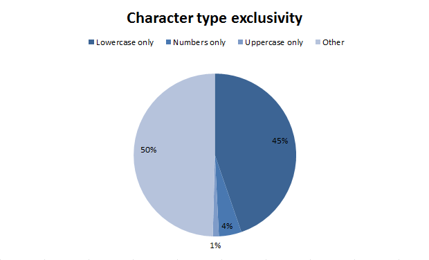

## Что такое надёжный пароль

Надёжный пароль является случайным и как следствие его трудно запомнить и это ведёт к проблеме повторного использования паролей, ведь если сервисов много, то пользователь почти неизбежно будет использовать один и тот же пароль везде, где можно. В этом случае он становится уязвим для [credential stuffing](https://owasp.org/www-community/attacks/Credential_stuffing) — атаки при которой известная пара почтового ящика и пароля проверяется на разных сервисах в надежде, что человек использовал эти данные в разных местах. Это серьёзная угроза, потому что повторное использование паролей одна из главных проблем безопасности. От этого защитит создание уникального пароля для каждого сайта. Но не обязательно помнить наизусть все используемые пароли или записывать их куда-либо. Для создания и хранения большого количества паролей существуют менеджеры паролей — программное обеспечение, которое помогает работать с паролями и PIN-кодами. Да, это позволяет потерять их одновременно, но тут надо понимать, что компрометация оффлайн хранилища паролей — довольно редкая ситуация, в отличие от компрометации одинаковых паролей на разных ресурсах. Менеджеру паролей не нужно быть идеальным. Ему нужно быть лучше, чем однотипные пароли везде.

Так же нужно помнить, что менеджер паролей защищён ровно настолько, насколько безопасен главный пароль, который вы используете для доступа к нему. Вы должны быть уверены, что его достаточная случайность и неугадываемость подтверждена количественными измерениями, а не только тем, что вы воспринимаете его случайным.

## Случайность, закономерность, энтропия

Для кого-то всё, что происходит вокруг, это одна сплошная случайность. А кто-то утверждает, что случайностей не бывает. Если не погружаться в философию при рассмотрении понятий «случайность» и «закономерность», а ограничиться только информационными технологиями то в них случайность числа трактуется как отсутствие алгоритма для его вычисления.

За долгую историю человечества было создано немало методов генерации случайных чисел (ГСЧ). Одни достаточно просты и понятны: игральные кости, монеты, колода карт и т.д. Другие же используют непредсказуемые физические процессы, такие как шумы атмосферы или тепловой шум.

Наряду с генераторами настоящих случайных чисел (ГНСЧ) базирующимися на непредсказуемых физических процессах часто используются и более простые в реализации генераторы псевдослучайных чисел (ГПСЧ) базирующиеся на математических алгоритмах.

Более подробно о ГНСЧ и ГПСЧ можно прочитать на [Random.org](http://www.random.org/)

Наглядно же разницу между ГНСЧ и ГПСЧ можно оценить по следующим изображениям:

ГНСЧ


ГПСЧ


Мерой неопределённости (случайности) является понятие информационной энтропии.

Энтропия — мера неопределённости, выраженная в битах. Так же энтропию можно рассматривать как меру равномерности распределения случайной величины.

Информационная двоичная энтропия, при отсутствии информационных потерь, рассчитывается по формуле Хартли:


где N — количество разных символов, i — количество информации в каждом символе сообщения.

Зависимость количества разных символов от классов символов, входящих в пароль:


Например, пароль из 10 случайных строчных и прописных букв имеет `log2(52 ^ 10) = 57` бит энтропии.

Чтобы вычислить удельную энтропию (её количество в одном символе заданного класса), можно использовать уравнение `log2(n ^ m) = m * log2(n)`. Получаем: `<длина> * log2(<количество разных символов>)`, где вторая часть является удельной энтропией. Пересчитаем по этой формуле предыдущую таблицу:


Для вычисления силы пароля нужно взять классы символов, которые входят в пароль, взять значения энтропии для этих классов и умножить на длину. Для приведённого выше примера пароля из 10 строчных и прописных букв мы получили `5.7 * 10 = 57 бит`. Но если увеличить длину до 14, то энтропия увеличится до 79,8 бит. А если оставить 10 символов, но добавить класс специальных символов, то общая энтропия будет равна 64 бит.

Приведённое уравнение позволяет быстро вычислить энтропию пароля, но тут есть подвох. Формула верна лишь в том случае, если символы не зависят друг от друга. А это относится только к сгенерированным (случайным) паролям.

Но если использовать более лёгкие для запоминания пароли вроде `Pa$$word11`, то энтропия у них будет гораздо ниже при том же количестве символов. Взломщику не придётся перебирать все возможные комбинации, достаточно лишь перебрать слова из словаря с некоторыми изменениями.

## Исследования паролей находящихся в общем доступе

### Исследование на основе списков Роба Боуза (Rob Bowes)

Если проанализировать 10 миллионов паролей, которые попали в общий доступ из-за утечек данных, выяснится, что чаще всего используются следующие 25:

```info
123456
123456789
qwerty
12345678
111111
1234567890
1234567
password
123123
987654321
qwertyuiop
mynoob
123321
666666
18atcskd2w
7777777
1q2w3e4r
654321
555555
3rjs1la7qe
google
1q2w3e4r5t
123qwe
zxcvbnm
1q2w3e
```

Представленная статистика свидетельствует в пользу того, чтобы делать пароли длиннее. Обратите внимание: из 25 самых популярных паролей только 5 имеют длину в 10 символов и больше. Соответственно, если мы установим минимум в 10 символов, то уже одним этим отсечём 80% списка.


### Sony Pictures database

Основатель сервиса проверки аккаунтов на утечки [Have I Been Pwned](https://haveibeenpwned.com/) Трой Хант (Troy Hunt), взял за основу своих исследований, базу пользователей Sony Pictures (стоит отметить, что все пароли в этой базе хранилась в открытом виде). Результаты исследования представлены ниже.

#### Длина пароля


Основное количество паролей имеют длину от 6 до 10 символов. При этом у половины он менее 8 символов.

#### Используемые символы



```statistics
1% — только буквы верхнего регистра
4% — только цифры
45% — только буквы нижнего регистра
50% — другие варианты
```

Данный пример показывает, что используются довольно однотипные пароли.

#### Словарные пароли


```statistics
36% — словарный пароль
64% — пароль не из словаря
```

Больше трети паролей, словарные.

#### Тест на уникальность


```statistics
8% — уникальный пароль
92% — повторно используемый пароль
```

На диаграмме отображено, сколько пользователей используют один и тот же пароль повторно.

#### Брутфорс хеша с использованием радужных таблиц


```statistics
18% — сложно взламываемый
82% — легко взламываемый через радужные таблицы
```

Все пароли хранились в открытом виде, но даже в случае если бы это были хеши, то с применением радужных таблиц удалось бы дешифровать примерно 82% паролей.

### Исследование Ата Хакчила (Ata Hakcil)

Специалист по информационной безопасности компании [WizCase](https://www.wizcase.com/) Ата Хакчил отфильтровал из большой базы данных состоящей из более чем миллиарда записей повреждённые данные, а так же убрал тестовые записи или строки в некорректном формате. В итоге он смог выделить 168919919 паролей и 393386953 логинов. Причём около 7 миллионов строк были с паролем «123456». По словам специалиста, этот «пароль» является самым распространённым у пользователей последние пять лет.

Дальнейший анализ данных Хакчила показал, что:

- самый распространённый пароль — «123456», он встречается примерно в 0,722% случаев, далее идут «123456789», «password», «qwerty», «12345678»;
- 1000 самых распространённых паролей, это примерно 6,607% от всех изученных паролей;
- 8,83% из общей базы паролей являются уникальными, остальные встречаются два и более раза;
- средняя длина пароля составляет 9,4822 символа;
- только 12,04% паролей содержат специальные символы;
- 8,79% паролей содержат только буквы;
- 26,16% паролей содержат символы только в нижнем регистре;
- 13,37% паролей содержат только цифры;
- 34,41% всех паролей заканчиваются цифрами, но только 4,522% паролей начинаются с цифр (тут, вероятно, имеются в виду смешанные пароли — с буквами и цифрами).

Также Хакчил [опубликовал](https://github.com/FlameOfIgnis/Pwdb-Public/tree/master/wordlists/language-specifics) списки из 150-ти самых слабых паролей среди пользователей, которые говорят на различных языках, например, на [русском](https://github.com/FlameOfIgnis/Pwdb-Public/blob/master/wordlists/language-specifics/ignis-russian-150.txt).

### Другие исследования

Анализ проведённый в компании [WPEngine](https://wpengine.com/resources/passwords-unmasked-infographic/) даёт информацию по типичной длине паролей, чаще всего это от 6 до 9 символов. 11 и более символов используют менее 5% пользователей.

По данным [PasswordResearch](http://passwordresearch.com/stats/statindex.html), примерно две трети пользователей используют одинаковые пароли на разных сервисах, сохраняют пароли открытым текстом, в том числе в электронном виде, забывают пароли, что побуждает использовать более простые комбинации.

Примеры плохих паролей (на основе утечки [antichat.ru](https://forum.antichat.ru/)):

```info
123321123321123 — цифр вроде много, но паттерн очевиден.
1qaz2wsx3edc — удобно набирается и так же удобно конструируется.
123456610q — наивно полагать, что один символ изменит качество пароля.
ilovepussy777 — по сути это один символ + три релевантых слова.
[fuckitall] — данная комбинация слишком часто встречается, чтобы считать что она влияет на надёжность.
Hellsp@wn — по сути словарное слово.
Jhnjgtl12 — раскладку перепутали? Очередное словарное слово (ортопед12).
dalex3pro — d + имя + цифра + частое сочетание букв.
PANASONIC13 — известная брэнд.
iphone3g — ещё один известный брэнд. Не стоит использовать что-то, что у всех на слуху.
qCkiYSJ625 — и вот казалось бы пароль из случайныех символов, но кто ж знал, что он состоит из достаточно часто употребляемых комбинаций сам по себе.
```

## Какие рекомендации по политике паролей даются крупными компаниями и организациями

### NordPass

По результатам исследования проведённом в компании [NordPass](https://nordpass.com/most-common-passwords-list/) пользователям советуют воздержаться от повторяющихся символов, таких как «aaaa» или «123abc», и не выбирать пароли на основе личных данных, которые могут быть не полностью конфиденциальными, таких как номер телефона, дата рождения или имя, а также рекомендуют создавать пароли не короче 12 символов, использовать сочетание прописных и строчных букв, цифр и символов.

### Positive Technologies

Результаты тестирований уровня безопасности систем, проведённых в [Positive Technologies](https://www.ptsecurity.com/ru-ru/research/analytics/external-pentests-2020/), показали, что подавляющее большинство успешно подобранных в ходе тестирований защищённости паролей были составлены предсказуемым образом. Половина из них была связана с различными комбинациями месяца или времени года с цифрами, обозначающими год (например, Fduecn2019, Зима2019). На втором месте по распространённости оказались пароли типа 123456, 1qaz!QAZ, Qwerty1213, которые составляются из близкорасположенных клавиш на клавиатуре.

### Microsoft

В документе [Microsoft Password Guidance](https://www.microsoft.com/en-us/research/wp-content/uploads/2016/06/Microsoft_Password_Guidance-1.pdf) представленном Microsoft Identity Protection Team в советах по созданию надёжного и уникального пароля: просят создавать пароли длиннее 8 символов, не использовать один и тот же пароль на разных сайтах, не использовать в качестве паролей простые фразы, личную информацию и самое главное они отменяют требование к сложности, длине и регулярной смене пароля.

Требования к сложности пароля:

> Требования к сложности пароля заставляют пользователей действовать предсказуемым образом, принося больше вреда, чем пользы.
>
> Большинство людей используют похожие шаблоны, например, заглавная буква в первой позиции, символ в последней и цифра в последней. Киберпреступники знают это, поэтому они проводят атаки по словарю, используя наиболее распространённые замены, "$" для "s", "@" для "a", "1" для "l".
>
> Принуждение пользователей к выбору комбинации верхних, нижних цифр и специальных символов имеет негативный эффект. Некоторые требования к сложности даже не позволяют пользователям использовать безопасные и запоминающиеся пароли и заставляют их придумывать менее безопасные и менее запоминающиеся пароли.

Чрезмерные требования к длине (более 10 символов) могут привести к неправильному поведению пользователя:

> Например, пользователи, которым требуется пароль из 16 символов, могут
> выбирать повторяющиеся шаблоны, такие как четыре, четыре, четыре или пароль, пароль, пароль, соответствующий требованиям по длине пароля, но который не сложно угадать.
> Кроме того, требования к длине пароля повышают вероятность того, что пользователи будут применять другие небезопасные методы, такие как запись своих паролей, их повторное использование или хранение в незашифрованном виде.

Требования к истечению срока действия пароля для пользователей:

> Требования к истечению срока действия пароля приносят больше вреда, чем пользы, потому что эти требования заставляют пользователей выбирать предсказуемые пароли, состоящие из последовательных слов и чисел, которые тесно связаны друг с другом. В этих случаях следующий пароль можно предсказать на основе предыдущего пароля. Что касается снижения рисков, смена пароля и здесь не играет большой роли, поскольку киберпреступники почти всегда используют учётные данные, как только они их скомпрометируют.

Аналогичные заявления были представлены и в официальном [блоге](https://blogs.technet.microsoft.com/secguide/2019/05/23/security-baseline-final-for-windows-10-v1903-and-windows-server-v1903/) компании со списком изменений к версии *Windows 10 Version 1903*. Сами правила и системные политики *Windows 10 Version 1903* и *Windows Server 2019 Security Baseline* внесены в комплект [Microsoft Security Compliance Toolkit 1.0](https://www.microsoft.com/en-us/download/details.aspx?id=55319).

В Microsoft популярно объясняют в блоге, почему отказалась от правила обязательной смены пароля:

> Периодическое истечение срока действия пароля является защитой только от вероятности того, что пароль (или хэш) будет украден в течение его срока действия и будет использоваться неавторизованным лицом. Если пароль не украден, нет смысла его менять. И если у вас есть доказательства того, что пароль украден, вы, очевидно, захотите действовать немедленно, а не ждать истечения срока действия, чтобы устранить проблему.
>
> Если известно, что пароль, вероятно, будет украден, сколько дней является приемлемым периодом времени, чтобы позволить вору использовать этот украденный пароль? Значение по умолчанию — 42 дня. Разве это не кажется смехотворно долгим временем? Действительно, это очень долго, и всё же наш текущий базовый показатель был установлен на 60 дней — а раньше на 90 дней — потому что форсирование частого истечения вводит свои собственные проблемы. И если пароль не обязательно будет украден, то вы приобретаете эти проблемы без пользы. Кроме того, если ваши пользователи готовы обменять пароль на конфетку, никакая политика истечения срока действия паролей не поможет.
>

Аргументация Microsoft по этому вопросу заключается в том, что политики срока действия паролей несут малую ценность с точки зрения информационной безопасности. В результате они больше не рекомендуют их применение и исключили этот элемент из структуры фундаментального уровня кибербезопасности от Microsoft.

В Microsoft считают, что политики, нацеленные изначально на исключение скомпрометированных паролей из ротации, по факту только поощряют плохую практику – например, повторное использование и слабую итерацию (vesna2019, leto2019, zima2019) паролей, шпаргалки на мониторах и т.д.

Словом, в Microsoft говорят, что риск от плохих практик использования паролей на самом деле выше, чем выгода от внедрения политик по сроку действия.

В Microsoft пишут, что базовые политики безопасности предназначены для использования хорошо управляемыми, заботящимися о безопасности предприятиями. Они также призваны служить руководством для аудиторов.

> Периодическое истечение срока действия пароля является древней и устаревшей мерой защиты, и мы не считаем, что для нашего уровня базовой защиты стоит применять какое-либо конкретное значение. Удаляя его из нашего базового уровня, организации могут выбирать то, что наилучшим образом соответствует их предполагаемым потребностям, не противореча нашим рекомендациям.

Получается, что периодическая смена паролей делает компанию более привлекательной мишенью для атак.

Вместо бесконечного запоминания «стойких паролей с переменным регистром и спецсимволами» пользователи начинают их банально записывать или использовать шаблоны. И приставить к каждому сотруднику надзирателя, который бы проверял уникальность каждого нового пароля невозможно.

Мощность современных компьютеров позволяет подобрать перебором пароль длиной в 8 цифробуквенных символов за несколько часов. Смена одного или двух символов из этих восьми не сделает задачу сложнее.

### Другие организации

#### Национальный институт стандартов и технологий (National Institute of Standards and Technologies — NIST)

В июне 2017 года в NIST закончили двухлетнюю работу по переработке стандарта [NIST Special Publication 800-63B](https://pages.nist.gov/800-63-3/sp800-63b.html). Первоначально планировалось ограничиться лёгкими правками, но в итоге группе сотрудников пришлось переписывать всё практически с нуля. В новых правилах нет обязательного требования использовать специальные символы (такие как вопросительные и восклицательные знаки) и отсутствует требование по обязательной смене пароля.

Обновлённый стандарт рекомендует использовать длинные парольные фразы, лёгкие для запоминания, но трудные для брутфорса:

> Верификаторы должны разрешать ввод любого секретного кода длиной до 64 символов на выбор подписчика.
>
> Верификаторы не должны вводить дополнительные правила составления секретного кода (например, требовать использования разных типов символов или запрещать вводить одинаковые символы подряд).

Менять пароли теперь рекомендуется только в том случае, если существует вероятность их компрометации, то есть если имеются признаки утечки:

> Не требуйте произвольного изменения паролей (например, периодически), если нет запроса пользователя или доказательства компрометации пароля.

Рекомендация насчёт стойкости пароля:

> Для обеспечения криптографической стойкости для нужд Федерального правительства сегодня требуется не меньше 112 бит (например, для шифрования или подписи данных).

#### Национальный центр по кибербезопасности (National Cyber Security Centre — NCSC)

В NCSC разделяют мнение, что на сегодняшний день вынужденная замена паролей — это анти-патерн в информационной безопасности. Вот что они говорят об этой практике [в своем руководстве по управлению паролями](https://www.ncsc.gov.uk/guidance/password-guidance-simplifying-your-approach):

> Вынужденная замена паролей не приносит никакой реальной пользы, так как взломанные пароли обычно используются сразу же.
>
> Просите пользователей поменять пароль только в том случае, если появились признаки или подозрения, что старый пароль скомпрометирован.

Но NCSC идёт ещё дальше и предлагает следующую рекомендацию, явно с расчетом на то, чтобы организации давали своим сотрудникам возможность создавать пароли и управлять ими, не рискуя безопасностью:

> Вы также должны обеспечивать соответствующее оборудование для хранения паролей с уровнем защиты, соответствующим конфиденциальности информации, которую вы стремитесь обезопасить. Эти хранилища могут быть как материальными (например, сейфы), так и техническими (например, особые программы для управления паролями) или сочетать в себе аспекты тех и других. Крайне важно, чтобы ваша организация предоставляла санкционированный механизм, который помогал бы пользователям осуществлять контроль над паролями: это избавит их от необходимости прибегать к ненадёжным «скрытым» методам, чтобы справиться с обилием паролей.
>
> 1. Отслеживайте все случаи авторизации, чтобы выявлять необычное поведение.
> 2. Сообщайте пользователям подробности о попытках входа, неважно удачными они были или неудачными. В свою очередь, пользователи должны оповещать вас, если какие-то из этих попыток исходили не от них.

#### Федеральное бюро расследований в Портленде (Federal Bureau of Investigation in Portland — FBI Portland)

Представители отделения ФБР в Портленде [отдают предпочтение альтернативному варианту работы с паролями](https://www.fbi.gov/contact-us/field-offices/portland/news/press-releases/oregon-fbi-tech-tuesday-building-a-digital-defense-with-passwords) — парольным фразам. Их проще запомнить, чем цифробуквенные пароли со специальными символами и при этом они считаются более надёжными.

В 2015 году специалист в области информатики Евгений Панферов [математически доказал](https://arxiv.org/pdf/1505.05090.pdf), что для усиления защиты от брутфорс-атак необходимо удлинять идентификатор, а не увеличивать его сложность за счёт цифр, решёток и звёздочек.

Достаточно выбрать шесть слов, чтобы получить случайный идентификатор из 25–30 знаков.

#### Французский исследовательский институт Eurecom

Группой экспертов по безопасности, которые работают во французском исследовательском институте Eurecom установлено, что почти каждый из нас склонен ставить заглавные буквы в начале пароля, а цифры – в конце.

## Какой длины должен быть надёжный пароль?

Из всего вышесказанного мы знаем, что надёжный пароль должен быть длиной не менее 10 символов и что чем больше в пароле энтропии, тем сложнее его взломать. Но сколько энтропии будет достаточно?

Из приведённой ранее рекомендации NIST мы знаем, что надёжный пароль должен содержать не менее 112 бит энтропии.

А какая длинна пароля будет соответствовать энтропии 112 бит?

В зависимости от используемых классов символов длина составит:

Для латинского алфавита с использованием только строчных или только прописных букв длина пароля составит 24 символа.

Для латинского алфавита с использованием строчных и прописных букв длина пароля составит 20 символов.

Дальнейшее усложнение используемого алфавита путём добавления цифр и спецсимволов будет снижать необходимую длину пароля на один символ и составит соответственно 19 и 18 символов.

Но напомню ещё раз — это относится только к случайным (сгенерированным) паролям. При использовании парольных фраз энтропия будет меньше, а значит длина пароля должна быть больше.

Зависимость стойкости пароля от энтропии:

| **Энтропия** | **Уровень стойкости** | **Комментарий**                                              |
| ------------ | --------------------- | ------------------------------------------------------------ |
| < 28 бит     | Очень слабый          | Допустимо защищать только не ценную информацию.              |
| 28-35 бит    | Слабый                | Способен остановить большое число начинающих взломщиков, идеально подходит для использования в качестве desktop-пароля. |
| 36-59 бит    | Средний               | Вполне пригоден для использования для компьютеров в корпоративной сети. |
| 60-127 бит   | Высокий               | Может быть хорошим для того, чтобы охранять финансовую информацию. |
| > 128 бит    | Сверхнадёжный         | Пароль обладает очень большой стойкостью к подбору.          |

## Может ли человек создать надёжный пароль

Если кратко, то компьютер может, а человек — нет.

Дело в том, что человеческий мозг [не способен](https://medium.com/s/one-weird-trick/think-of-a-number-why-humans-and-machines-are-bad-at-being-random-551f3db79e72) сгенерировать случайную последовательность чисел. Мы подсознательно стремимся выбирать цифры, которые имеют для нас какое-либо значение. Поэтому ещё в 1890 году английский психолог Фрэнсис Гальтон (Francis Galton) [писал](http://galton.org/essays/1890-1899/galton-1890-dice.pdf), что игральная кость — это наиболее эффективный «генератор случайности». Человеческие «случайные» последовательности «ловятся» очень просто ([Гадалка Шеннона](https://sites.google.com/site/ltwood/projects/heshby/shannon) — [реализация Гадалки Шеннона](http://zasvitom.com/index.php/2020/02/10/shannon-model/#:~:text=%D0%93%D0%B0%D0%B4%D0%B0%D0%BB%D0%BA%D0%B0%20%D0%A8%D0%B5%D0%BD%D0%BD%D0%BE%D0%BD%D0%B0%20%E2%80%93%20%D0%B0%D0%BB%D0%B3%D0%BE%D1%80%D0%B8%D1%82%D0%BC%2C%20%D0%BF%D0%BE%D0%B7%D0%B2%D0%BE%D0%BB%D1%8F%D1%8E%D1%89%D0%B8%D0%B9%20%D0%BF%D1%80%D0%B5%D0%B4%D1%83%D0%B3%D0%B0%D0%B4%D1%8B%D0%B2%D0%B0%D1%82%D1%8C,%D0%BB%D0%B8%20%D0%BE%D0%BD%20%D0%BF%D1%80%D0%B5%D0%B4%D1%83%D0%B3%D0%B0%D0%B4%D0%B0%D1%82%D1%8C%20%D1%8D%D1%82%D0%BE%D1%82%20%D0%BE%D1%82%D0%B2%D0%B5%D1%82.) ещё одна [реализация Гадалки Шеннона](https://vakhrushev.me/articles/2019-05-01-predictor/)). Это связано с нашим неверным интуитивным пониманием теории вероятностей (отсюда в ней так много кажущихся парадоксов). Например, нам кажется, что три повторяющихся подряд числа для равномерного распределения чисел от 1 до 9 — это какое-то безумно редкое событие, а на самом деле это совсем не так.

Ещё один способ распознать «человеческую последовательность» — это построить гистограмму распределения чисел. То есть посчитать сколько раз конкретное число встречается в данной последовательности. Для предыдущего примера — это 10 столбиков с высотой равной количеству раз использования данного числа в последовательности. Понятно, что высота всех столбиков должна быть примерно одинаковой. В «человеческой последовательности» будет заметный перекос в высотах.

Анекдот:

> Анна Вадимовна, можно вопрос?
> Конечно, Кипятков.
> Вот вы у нас программирование преподаёте, уж вы-то точно должны знать. Как программа выдаёт нам случайное число?
> Спрашиваете функцию random, она и выдаёт случайное число.
> Это понятно, а функция-то откуда берёт это число?
> Запрашивает у компьютера.
> А компьютер как придумывает случайное число?
> Например, регистрирует момент вызова и преобразует дату в соответствующее число.
> Постойте... Получается, если два раза вызвать random, то из первого числа и интервала между вызовами можно вычислить второе? Какая же это случайность тогда?
> Ну, а ты что хотел, Кипятков?
> Совершенно случайное число...
> Тогда вот тебе задание на дом — почитай про тепловой шум с транзисторов, который преобразуется в последовательность нулей и единиц, чтобы составить случайное число нужной величины.
> ...А шум, что, случайный?
> Так, Кипятков! Что ты мне голову морочишь? Если умный такой, назови мне случайное число!
> Я-то могу, я же человек. А вот ваш компьютер, оказывается, не может!
> Называй, называй. Последовательность чисел мне, случайную.
> Легко! 38 46 11 40! — сказал Кипятков, у которого был 38-ой размер ноги, но его 46-летняя мать покупала ему на два размера больше, поскольку им приходилось на всём экономить с тех самых пор, как 11 лет назад отец ушёл из их семьи. Через 40 минут Кипяткова побили за гаражами.

## Политика паролей учётных записей в Active Directory

Для обеспечения высокого уровня безопасности учётных записей в домене Active Directory (AD) необходимо настроить и внедрить политику паролей, обеспечивающую достаточную сложность пароля пользователей и сервисных учётных записей. Тем самым можно усложнить злоумышленнику возможность подбора или перехвата паролей пользователей и сервисов.

В домене AD настройка единых требований к паролям пользователей осуществляется с помощью групповых политик находящихся в Group Policy Object (GPO).

Политики паролей находятся в следующем разделе редактора GPO: `Конфигурация компьютера` — `Конфигурация Windows` -> `Параметры безопасности` -> `Политики учётных записей` -> `Политика паролей` (`Computer configuration` -> `Windows Settings` -> `Security Settings` -> `Account Policies` -> `Password Policy`).

### Политики паролей

- **Вести журнал паролей (Enforce password history)** – определяет количество старых паролей, которые хранятся в AD, запрещая пользователю повторно использовать старый пароль.
- **Максимальный срок действия пароля (Maximum password age)** – определяет срок действия пароля в днях. После истечения срока действия пароля система потребует у пользователя сменить пароль. Обеспечивает регулярность смены пароля пользователями. В соответствии с современными рекомендациями рекомендуется устанавливать 0 — неограниченный срок действия пароля
- **Минимальный срок жизни пароля (Minimum password age)** – как часто пользователи могут менять пароль. Этот параметр не позволит пользователю несколько раз подряд сменить пароль, чтобы вернуться к любимому старому паролю, перезаписав пароли в журнале паролей (password history). При использовании неограниченного срока действия пароля можно установить в 0 иначе рекомендуемое значение составляет 1 день.
- **Минимальная длина пароля (Minimum password length)** – рекомендуется использовать пароль длиной не менее 10 символов (при значении 0 пароль не требуется).
- **Пароль должен отвечать требование сложности (Password must meet complexity requirements)** – при включении этой политики пользователю запрещено использовать имя своей учётной записи в пароле (не более чем два символа подряд из username или firstname), также в пароле должны использоваться 3 типа символов из следующего списка: цифры (0 – 9), символы в верхнем регистре, символы в нижнем регистре, спец символы ($, #, % и т.д.). В современных рекомендациях данная политику рекомендуют не использовать.
- **Хранить пароли, использую обратимое шифрование (Store passwords using reversible encryption)** – пароли пользователей в базе AD хранятся в зашифрованном виде, но в некоторых случаях некоторым приложениям нужно предоставить доступ к паролям в домене. При включении этой политики пароли хранятся в менее защищённой виде (по сути открытом виде), что небезопасно (можно получить доступ к базе паролей при компрометации Domain Controller (DC), в качестве одной из мер защиты можно использовать Read Only Domain Controller — RODC)).

### Политика блокировки учетной записи (Account Lockout Password)

- **Пороговое значение блокировки (Account Lockout Threshold)** – как много попыток набрать неверный пароль может сделать пользователь перед тем, как его учётная запись будет заблокирована. При минимальной длине пароля 10 символов и средней скорости печати 220 символов в минуту можно установить данный параметр от 10 до 20 попыток (оптимально 15), так как человек в отличие от машины не будет раз за разом набирать неверный пароль, и получив сообщение о том, что пароль неверный сделает паузу перед тем как попытаться снова тем самым снизив среднюю скорость печати.
- **Продолжительность блокировки учётной записи (Account Lockout Duration)** – на какое время нужно блокировать учётную запись (запретить вход), если пользователь ввел несколько раз неверный пароль. Время блокировки с одной стороны должно быть большим, чтобы затруднить брутфорс специализированными программами, а с другой достаточно маленьким чтобы не раздражать пользователя. Как правило блокировки учётной записи на 10 минут достаточно.
- Время до сброса счетчика блокировки (Reset account lockout counter after) – через сколько минут после последнего ввода неверного пароля счетчик неверных паролей (Account Lockout Threshold) будет сброшен. Как правило 1 минута.

Настройки парольных политик домена AD по-умолчанию перечислены в таблице:

| Политика                                    | Значение по-умолчанию |
| ------------------------------------------- | --------------------- |
| Enforce password history                    | 24 пароля             |
| Maximum password age                        | 42 дня                |
| Minimum password age                        | 1 день                |
| Minimum password length                     | 7                     |
| Password must meet complexity requirements  | Включено              |
| Store passwords using reversible encryption | Отключено             |
| Account lockout duration                    | Не определено         |
| Account lockout threshold                   | 0                     |
| Reset account lockout counter after         | Не определено         |

Политика паролей применяется к компьютерам домена, а не пользователям.

В версии AD, представленной в Windows Server 2000 можно было создать только одну политику паролей на весь домен.

В Windows Server 2008, разработчики добавили отдельную от GPO возможность управления настройками паролей с помощью детальной политики паролей (Fine-Grained Password Policies — FGPP). FGPP позволяют создать в одном домене множество специальных политик управления паролями (Password Settings Policy — PSO), определяющих требования к паролям (длина, сложность, история) и блокировки учётных записей. Политики PSO могут быть назначены на конкретных пользователей или группы, но не на контейнеры (Organizational Unit — OU) AD. Причём, если к пользователю привязана политика PSO, настройки парольной политики из стандартных GPO к нему более не применяются.

К примеру, с помощью FGPP, можно наложить более высокие требования на длину и сложность пароля для учётных записей администраторов, сервисных учётных записей или пользователей, имеющих внешний доступ к ресурсам домена.

Основные требования для использования множественных политик паролей FGPP в домене:

- функциональный уровень домена Windows Server 2008 или выше
- парольные политики можно назначить на пользователей или глобальные группы безопасности (Global Security)
- FGPP политика применяется целиком (нельзя часть настроек описать в GPO, а часть в FGPP)

Главный недостаток новшества в Windows Server 2008 – отсутствие удобных инструментов управления политиками паролей, настройку которых можно было выполнить только из низкоуровневых утилит по работе с AD, например ADSIEdit, ldp.exe, LDIFDE.exe.

В Windows Server 2012 в консоли Active Directory Administration Center (ADAC) появился новый графический интерфейс для управления парольными политиками FGPP.

Для настройки FGPP, в домене Windows Server 2012 нужно запустить с правами администратора консоль ADAC, переключиться в древовидный вид и развернуть контейнер `System`. Найти контейнер `Password Settings Container`, щёлкните по нему правой клавишей мыши и выберать `New` -> `Password Settings`.

В открывшемся окне нужно указать имя политики паролей и задать её настройки. Все поля как и в стандартной политике паролей. Обратите внимание на атрибут `Precedence`. Данный атрибут определяет приоритет данной политики паролей. Если на объект действую несколько политик FGPP, к объекту будет применена политика с меньшим значением в поле `Precedence`.

> **Примечание**.
>
> Если на пользователя действуют две политики с одинаковыми значениями Precedence, будет применена политика с меньшим Globally Unique Identifier (GUID).
>
> Если на пользователя назначены несколько политик, причём одна из них действует через группу безопасности AD, а вторая – напрямую на учётную запись, то будет применена политика, назначенная на учётную запись.

Затем в секции `Direct Applies To` нужно добавить группы/пользователей, на которых должна действовать политика, после чего сохраните политику.

С этого момента данная парольная политика будет применяться на всех пользователей или членов групп указанных в политике.

## Управление локальными паролями администраторов (Local Administrator Password Solution — LAPS)

Очень часто при развёртывании рабочих станций в домене в качестве пароля локального администратора используется один и тот же пароль устанавливаемый либо вручную, либо с помощью предпочтений групповой политики (Group Policy Preferences). Данный подход плох тем, что при компрометации данной учётной записи злоумышленник получит доступ не к одной конкретной машине, а к о всем машинам на которых используется данный пароль. Эту проблему можно устранить несколькими способами:

1. Установка на каждую машину уникального пароля локального пароля с последующим занесением информации в менеджер паролей;
2. Использовать систему, которая будет автоматически генерировать случайные пароли для каждого компьютера и менять их по установленному расписанию, например LAPS.

LAPS является наследником решения AdmPwd, которое было поглощено Microsoft и переименовано в LAPS. LAPS бесплатен и не требует дополнительных расходов на инфраструктуру, так как использует Active Directory в качестве базы данных.


LAPS является крайне продуманным и надежным решением состоящим из следующих компонентов:

- Агент — расширение групповой политики устанавливаемое на все управляемые ПК через MSI (отвечает за генерацию пароля и сохранении его в соответствующем объекте AD);
- Модуль PowerShell — используется для настройки LAPS;
- Active Directory — хранит пароль локального администратора.

Агент вызывается при каждом обновлении групповой политики и выполняет следующие задачи:

- Проверяет не истёк ли срок действия пароля локального администратора;
- Генерирует новый пароль, если текущий истёк или требуется его замена до истечении срока действия;
- Меняет пароль локального администратора;
- Сохраняет пароль в соответствующем атрибуте объекта AD;
- Сохраняет срок действия пароля в соответствующем атрибуте объекта AD;

Пароль может быть прочитан администраторами, а также промаркирован как требующий замены при следующем обновлении политики.

Полная диаграмма работы LAPS:


## Управляемые учётные записи служб (Managed Service Accounts — MSA) и групповые управляемые учётные записи служб (Group Managed Service Accounts — gMSA)

Технология управляемых служебных записей впервые была представлена в Windows Server 2008 R2 и предназначена для автоматической смены паролей учетных записей сервисов. Благодаря использованию механизма MSA можно существенно снизить риск компрометации системных учётных записей, из-под которых запущены системные службы (существует большое количество утилит, позволяющих извлечь пароли локальных пользователей из сервиса проверки подлинности локальной системы безопасности (Local Security Authority Subsystem Service — LSASS)).

Для учётных записей MSA генерируется пароль длиной 240 символов, из которых половина — английские буквы, другая половина — служебные символы. Пароль такой учётной записи меняется автоматически (по-умолчанию каждые 30 дней) и не хранится на локальной системе.

Основным недостатком MSA является возможность использования подобной служебной записи только на одном компьютере. Это означает, что служебные учётные записи MSA не могут работать с кластерными службами и службами сетевой балансировки нагрузки (Network Load Balancing — NLB), которые работают одновременно на нескольких серверах и используют одну учётную запись и пароль.

Для преодоления указанного недостатка в компании Microsoft разработали групповые управляемые учётные записи служб. Данный функционал доступен начиная с Windows Server 2012. Такие учётные записи можно одновременно использовать на нескольких серверах.

Чтобы воспользоваться возможностями gMSA, нужно, чтобы инфраструктура соответствовала следующим требованиям:

- Уровень схемы AD — Windows Server 2012;
- Контроллер домена Windows Server 2012 (и выше) со службой служба распространения ключей (Microsoft Key Distribution Service — KDC) — именно это служба отвечает за генерацию паролей;
- PowerShell модуль для управления Active Directory;
- В качестве клиентов могут использоваться Windows Server 2012 / Windows 8 и выше;
- Служба, использующая gMSA должна быть совместима с этим типом аккаунтов (должно быть указано в документации).

## Защищённые пользователи (Protected Users)

В версии AD, представленной в Windows Server 2012 R2, с целью повышения уровня защищённости безопасности привилегированных учётных записей появилась новая глобальная группа безопасности — защищённые пользователи. Предполагается, что члены этой группы получают дополнительный уровень ненастраиваемой защиты против компрометации учётных данных во время выполнения процедуры проверки подлинности.

На членов этой группы действуют следующие ограничения:

- Члены этой группы могут аутентифицироваться только по протоколу Kerberos. Аутентифицироваться с помощью NTLM, дайджест-проверки (Digest Authentication) или CredSSP не удастся;
- Для пользователей этой группы в протоколе Kerberos при предварительной проверке подлинности не могут использоваться слабые алгоритмы шифрования, такие как DES или RC4 (требуется поддержка как минимум AES) ;
- Эти учётные записи не могут быть делегированы через ограниченную или неограниченную делегацию Kerberos;
- Долгосрочные ключи Kerberos не сохраняются в памяти, а это значит, что при истечении срока действия билета проверки подлинности (Ticket-Granting Ticket — TGT), — по умолчанию 4 часа, — пользователь должен повторно аутентифицироваться;
- Для пользователей данной группы не сохраняются данные для кэшированного входа в домен. Т.е. при недоступности контроллеров домена, эти пользователи не смогут аутентифицироваться на своих машинах через cached credential.

Группа Protected Users доступна только при функциональном уровне домена Windows Server 2012 R2 (и выше). Ограничения Protected Users работают на Windows Server 2012 R2 / Windows 8.1 и выше.

## Защита протоколов семейства LanManager

NTLM (NT LAN Manager) — это довольно старый протокол аутентификации Microsoft, который появился ещё в Windows NT. Несмотря на то, что в Windows 2000 Майкрософт внедрила более безопасный протокол аутентификации Kerberos, NTLM (в основном это NTLMv2) широко используется для аутентификации в Windows сетях до сих пор.

Основные проблема NTLMv1 — это слабое шифрование, хранение хэша пароля в оперативной памяти в службе локальной проверки подлинности (Local Security Authority — LSA), который можно извлечь различными утилитами (mimikatz) и использовать хэш для дальнейших атак, отсутствие взаимной проверки подлинности клиента и сервера, что делает вполне реальными атаки перехвата данных и неавторизованного доступа к ресурсам сети (утилиты типа Responder могут перехватывать данные NTLM, передаваемые по сети и использовать их для доступа к сетевым ресурсам) и ряд других уязвимостей.

Часть этих недостатков исправлена в более новой версии протокола — NTLMv2, который использует более криптостойкие алгоритмы шифрования и позволяет предотвратить популярные атаки на NTLM. Начиная с Windows 7 / Windows Server 2008 R2 использование NTLMv1 и LM для авторизации по умолчанию выключено.

Прежде чем полностью отказаться от NTLM в домене, нужно убедиться, что нигде не используется его более уязвимая версия — NTLMv1. В сети может имеется ряд устаревших устройств или служб, которые всё ещё используют аутентификацию NTLMv1 вместо NTLMv2 (или Kerberos).

Тип аутентификации можно задать с помощью доменной групповой политики. Откройте консоль управления доменными политиками. Перейдите в раздел `Конфигурация компьютера` -> `Политики` -> `Конфигурация Windows` -> `Параметры безопасности` -> `Локальные политики` -> `Параметры безопасности` (`Computer Configurations` -> `Policies` -> `Windows Settings` -> `Security Settings` -> `Local Policies` -> `Security Options`) и отредактируйте необходимые политики безопасности NTLM и аудита его использования:


Не забудьте применить эту политику и для контроллеров домена.

Если по результатам аудита выяснится, что протокол NTLMv1 не используется, то можно пойти дальше и попытаться отказаться от NTLMv2. NTLMv2 хотя и более защищённый протокол аутентификации, но всё равно существенно проигрывает Kerberos в плане безопасности (уязвимостей в NTLMv2 намного меньше, чем в NTLMv1, всё же существуют возможности перехвата и повторного использования данных, и отсутствует взаимная аутентификация).

Главный риск отключения NTLM — возможное использование в домене устаревших или некорректно настроенных приложений, которые всё ещё могут использовать проверку подлинности NTLM, и для перехода на Kerberos их придётся обновлять или настраивать особым образом.

## Заключение

Пароли должны быть надёжными, то есть их должно быть сложно угадать или вычислить методом полного перебора. Иными словами, чем больше символов и чем более случайным образом они подобраны, тем лучше. Это справедливо, даже если вы не используете одни и те же сочетания в разных местах. Сила пароля измеряется энтропией, и нужно стремиться к значению не менее 112 бит.

Для пароля используемого для входа в компьютер в корпоративной среде достаточно пароля длиной 10 символов. Для паролей администраторов, сервисов и различных служебных записей нужно использовать пароли не менее 20 символов.

Не использовать один и тот же пароль для различных сервисов, ведь если один сервис взломают, то другие сервисы окажутся под угрозой.

Не ограничивать пользователей в длине сложности и времени действия пароля, в противном случае они начнут использовать «шаблонизацию» паролей снижая их стойкость.

Предоставить пользователям средства для генерации и хранения надёжных паролей, таких как менеджеры паролей, так как люди не могут придумывать и заучивать надёжные, уникальные пароли для каждого сервиса, полагаясь только на свою память.

Лучше длинная парольная фраза (простые для запоминания но сложные для взлома) чем короткий пароль удовлетворяющий жёстким политикам но созданный с помощью «шаблонизации».


Не забывать про настройку политик паролей PSO и FGPP через GPO, внедрение LAPS, MSA и защиты учётных записей с повышенными привилегиями путём их включения в группу Protected Users. Не забывайте отключать устаревшие протоколы проверки подлинности LM и NTLMv1 и ограничивать использование NTLMv2 стараясь везде где возможно использовать kerbreros.

Не используйте Lightweight Directory Access Protocol (LDAP) без шифрования, так как по данному протоколу данные передаются открытым текстом (даже) пароли. Используйте LDAP через слой защищённых сокетов (Secure Sockets Layer — SSL) — LDAPS.

В качестве персонального менеджера паролей можно использовать кроссплатформенный менеджер паролей с открытым исходным кодом [KeePass](https://keepass.info/). Данный менеджер паролей так же в ограниченном виде можно использовать и для групповой работы (база поддерживает многопользовательскую работу) если не требуется разграничение прав доступа, в противном случае придётся создавать отдельные базы данных с различными паролями что затруднит работу с ними.

Менеджер паролей KeePass обладает устаревшим интерфейсом и если хочется чего-то по новей то имеется менеджер паролей [KeePassXC](https://keepassxc.org/) основанный на том же коде что и KeePass, но обладающий более современным интерфейсом.

Ещё один кроссплатформенный менеджер паролей с открытым исходным кодом и современным интерфейсом [Buttercup](https://buttercup.pw/).

Для корпоративного использования можно выбрать один из корпоративных менеджеров паролей поддерживающих LDAP (LDAPS) интеграцию и разграничение прав доступа, с открытым исходным кодом и размещением на собственных серверах, например: [TeeamPass](https://teampass.net/), [Passbolt](https://www.passbolt.com/), [Пассворк](https://passwork.ru/).

## Ссылки

[Исследование на тему паролей](https://habr.com/ru/post/129052/)

[Требования к паролям — полная чушь](https://habr.com/ru/company/productivity_inside/blog/323864/)

[Эксперты по кибербезопасности опубликовали список из двухсот самых используемых паролей 2019 года](https://habr.com/ru/news/t/480434/)

[Практические рекомендации по выбору паролей по результатам взлома antichat.ru](https://habr.com/ru/post/122633/)

[А давайте заставим пользователя использовать безопасный пароль](https://habr.com/ru/company/ruvds/blog/521564/)

[Как создать действительно случайный и доказуемо безопасный пароль](https://habr.com/ru/company/cloud4y/blog/347952/)

[Какова оптимальная длина пароля?](https://habr.com/ru/company/domclick/blog/515064/)

[Развенчивание мифов про безопасные пароли](https://habr.com/ru/company/panda/blog/271953/)

[Ещё об оценке стойкости пароля](https://habr.com/ru/sandbox/27520/)

[Топ-15 принципов управления паролями](http://web-control.ru/novosti/news_post/top-15-printsipov-upravleniya-parolyami)

[Практические рекомендации по выбору паролей по результатам взлома antichat.ru](https://habr.com/ru/post/122633/)

[Как выбрать случайное число от 1 до 10](https://habr.com/ru/post/459532/)

[Практические рекомендации по выбору паролей по результатам взлома antichat.ru](https://habr.com/ru/post/122633/)

[Политика паролей учетных записей в Active Directory](https://winitpro.ru/index.php/2018/10/26/politika-parolej-uchetnyx-zapisej-v-active-directory/)

[Настройка политики паролей Fine-Grained Password Policy в Windows 2012 R2](https://winitpro.ru/index.php/2017/01/18/nastrojka-politiki-parolej-fine-grained-password-policy-v-windows-2012-r2/)

[Local Administrator Password Solution](https://docs.microsoft.com/en-us/previous-versions/mt227395(v=msdn.10)?redirectedfrom=MSDN)

[Рекомендации по безопасности Microsoft: руководство по паролю локального администратора (LAPS) теперь доступно: 1 мая 2015 г.](https://support.microsoft.com/ru-ru/help/3062591/microsoft-security-advisory-local-administrator-password-solution-laps)

[Работаем с LAPS (Local Administrator Password Solution)](https://www.atraining.ru/laps-local-administrator-password-solution/)

[LAPS: управление паролями локальных администраторов на компьютерах домена](https://winitpro.ru/index.php/2015/05/07/ms-local-administrator-password-solution-upravlenie-parolyami-lokalnyx-administratorov-v-domene/)

[Управляем паролем локального администратора с помощью LAPS](https://habr.com/ru/post/440624/)

[Group Managed Service Accounts Overview](https://docs.microsoft.com/en-us/windows-server/security/group-managed-service-accounts/group-managed-service-accounts-overview)

[Управляемые учётные записи служб (Managed Service Accounts)](https://habr.com/ru/post/204780/)

[Managed Service Accounts – MSA](https://www.atraining.ru/managed-service-accounts-msa/)

[Group Managed Service Accounts в Windows Server 2012](https://winitpro.ru/index.php/2014/03/28/group-managed-service-accounts-v-windows-server-2012/)

[Managed Service Accounts в Windows Server 2016](https://www.atraining.ru/group-managed-service-accounts-msa-windows-server-2016/)

[Protected Users Security Group | Microsoft Docs](https://docs.microsoft.com/en-us/windows-server/security/credentials-protection-and-management/protected-users-security-group)

[Guidance about how to configure protected accounts](https://docs.microsoft.com/en-us/windows-server/identity/ad-ds/manage/how-to-configure-protected-accounts)

[Группа защищенных пользователей Active Directory](https://winitpro.ru/index.php/2014/12/11/protected-users-group-active-directory-2012r2/)

[Network security: LAN Manager authentication level](https://docs.microsoft.com/en-us/windows/security/threat-protection/security-policy-settings/network-security-lan-manager-authentication-level)

[How to enable NTLM 2 authentication](https://docs.microsoft.com/en-us/troubleshoot/windows-client/windows-security/enable-ntlm-2-authentication)

[Бронируем NTLM в домене Active Directory](https://www.atraining.ru/lm-ntlm-ntlmv2-armoring/)
